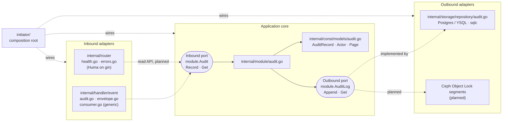

# dps-audit-service

The audit service of Project DPS, the Oromia Bank digital banking platform (requirements: DPS-UCS-P1-001 v1.4 §2.14).

It consumes every DPS domain event from Redpanda and keeps **one append-only record per event**. It is a Go 1.27 service built on **hexagonal architecture** (ports and adapters), with the import rules enforced by depguard.

> **Status.** The domain model, the `Audit` use case, the YSQL storage adapter, the schema, the event catalog and the audit Kafka consumer (`cmd/worker`, never drops a record, commits only after the store) are built and tested, including against Redpanda in containers. The WORM copy in Ceph, the OpenSearch indexer and the read API are planned. See [§8 Roadmap](#8-roadmap).

Runtime design (flows, deployment, data and event catalog, risks): [docs/architecture.md](docs/architecture.md).

---

## Table of contents

1. [What the service does](#1-what-the-service-does)
2. [Architecture](#2-architecture)
3. [Project layout](#3-project-layout)
4. [Running locally](#4-running-locally)
5. [Configuration](#5-configuration)
6. [Testing and benchmarks](#6-testing-and-benchmarks)
7. [Design decisions](#7-design-decisions)
8. [Roadmap](#8-roadmap)
9. [Extending the service](#9-extending-the-service)
10. [Make targets](#10-make-targets)

---

## 1. What the service does

| Concern | Behaviour |
|---|---|
| Input | Every DPS domain topic, `<domain>.events` (17 domains, 123 event types), in consumer group `audit.universal`. The event type is in the `x-dps-event-type` record header. |
| Record | One `AuditRecord` per event: envelope metadata (event ID and type, aggregate, producer, correlation and causation IDs, actor, channel, occurred-at), the Kafka position, and the payload exactly as received. |
| Dedupe | The primary key is the producer's `EventMetadata.event_id`, so a redelivered or re-published event is a no-op. An undecodable record gets `kafka:<topic>/<partition>/<offset>` and the Kafka timestamp, and is still kept (`metadata_valid=false`). |
| Append-only | The trigger `audit_records_append_only` refuses `UPDATE` and `DELETE`, even for the table owner. |
| Tamper evidence (planned) | A WORM copy in Ceph RGW S3 Object Lock (Compliance mode), segments per partition every 1–5 s. |
| Search | Aggregate and correlation lookups from the database. Actor, event-type and ad-hoc search from OpenSearch (planned). |
| Read API (planned) | `dps.audit.v1.AuditService`, read-only, in `cmd/api`. |

---

## 2. Architecture

### 2.1 Layers

The **core** (`internal/module`) holds the use case and declares **ports**: Go interfaces for what it offers and what it needs. Everything that touches the outside world is an **adapter**. The core never knows which adapters exist, so it is unit-tested with mocks and the store can change without touching business logic.



### 2.2 The dependency rule

> **Source code dependencies point inward.** Adapters depend on the core. The core depends only on the domain. Nothing depends on `initiator` except `cmd/*` (and `tests/e2e`, `tests/integration`).

`initiator/` is the **composition root**, the only package that knows every concrete type. `initiator/module.go` builds `Modules{Audit}` by plugging `repository.NewAudit(db.New(pool))` into `module.NewAudit(AuditDeps{Log, Logger})`.

| Folder | Layer | Audit files | Must **not** import |
|---|---|---|---|
| `internal/const/models` | Domain | `audit.go` | any internal package, any infra library |
| `internal/const/errors` | Domain | `errors.go` (errorx types, `HTTPStatus`) | adapters |
| `internal/module` | Core | `audit.go` (ports `Audit`, `AuditLog`; `NewAudit`) | gin, huma, pgx, go-redis, franz-go, temporal, grpc, `storage`, `router`, `handler`, `pkg`, `initiator` |
| `internal/const/dto` | Inbound (HTTP shapes) | `health.go` | `storage`, platform clients, infra drivers |
| `internal/router` | Inbound (HTTP) | `health.go`, `errors.go`, `middleware.go` | `storage` |
| `internal/handler/event` | Inbound (Kafka) | `audit.go` (`AuditConsumer`), `envelope.go` (`decodeRecord`), `consumer.go` (generic) | `storage` |
| `internal/storage/repository` | Outbound | `audit.go` | `router`, `handler` |
| `internal/storage/repository/db` | Generated by sqlc. **Do not edit** | | |
| `internal/const/{database,cache,messaging,workflow}` | Platform clients (how to connect) | | `module`. Imported only by `initiator` and `internal/storage` |
| `internal/const/events` | Event catalog (names, topics, consumer group) | one file per domain, `events.go` | |
| `internal/const/migrations`, `queries` | Schema and sqlc queries | `000001_audit.{up,down}.sql`, `audit.sql` | |
| `pkg/dpsapi/gen` | Generated dps-contracts code (`make proto`). **Do not edit** | | `internal/...` |
| `initiator` | Composition root | | |

These rules are **enforced by the linter**: `.golangci.yml` has depguard rule sets (`domain`, `core`, `inbound`, `sdk`, `composition-root`, `dto`, `infra-clients`), listed in [docs/architecture.md §4.3](docs/architecture.md#43-import-rule-enforcement). Importing pgx from `internal/module` fails `make lint`:

```
internal/module/x.go:3:8: import 'github.com/jackc/pgx/v5' is not allowed from list 'core':
core must not know the database; declare a port (depguard)
```

### 2.3 Ports, validation and errors

- **Ports live with their user.** `module.AuditLog` is declared in `internal/module/audit.go`, not next to the repository. The adapter asserts conformance at compile time (`var _ module.AuditLog = ...`).
- **Validation.** Huma tags validate HTTP shapes at the edge. `validator` tags on `models.AuditRecord` (`EventID`, `EventType`, `OccurredAt`, `Topic` are required; `Payload` may be empty) are checked in the core whatever the entry point; a failure becomes `ErrInvalidInput`.
- **Errors.** Only adapters know driver errors. The repository maps `pgx.ErrNoRows` to `ErrNotFound` and other driver errors to `ErrDBWrite` / `ErrDBRead`. The router maps app errors with `apperrors.HTTPStatus`; 5xx details are logged with the trace ID and never sent to the client.

### 2.4 Two processes, one codebase

| Binary | Runs today | Planned |
|---|---|---|
| `cmd/api` (`InitiateAPI`) | `/healthz`, `/readyz`, `/docs`; optional pprof | read API |
| `cmd/worker` (`InitiateWorker`) | the audit consumer (`initiator.BuildWorker`: Postgres + a consumer-group client on every `kafka.topics.<domain>`, group `audit.universal`); optional pprof | WORM segment writer |

`initiator/platform.go` has optional clients for Postgres, Valkey, the Kafka producer and Temporal, selected per process by a `needs` struct. Today both `apiNeeds` and `workerNeeds` are Postgres only.

---

## 3. Project layout

```
.
├── cmd/
│   ├── api/main.go                 # API entry (-openapi prints the spec)
│   └── worker/main.go              # worker entry
├── config/                         # config.go (koanf) + config.yaml (local defaults)
├── initiator/                      # COMPOSITION ROOT
│   ├── config.go                   # config + zap logger
│   ├── platform.go                 # optional platform clients (needs), OpenTelemetry, ordered close
│   ├── module.go                   # Modules{Audit}
│   ├── handler.go                  # gin + middleware + Huma, health checks, registerRoutes (empty)
│   └── initiator.go                # InitiateAPI / InitiateWorker / BuildAPI / BuildWorker, shutdown, pprof
├── internal/
│   ├── const/
│   │   ├── models/audit.go         # DOMAIN: AuditRecord, Actor, Page
│   │   ├── errors/                 # DOMAIN: error taxonomy (errorx) + HTTP mapping
│   │   ├── dto/health.go           # HTTP shapes
│   │   ├── events/                 # event catalog: one file per domain + events.go
│   │   ├── migrations/             # 000001_audit.{up,down}.sql (embedded, also the sqlc schema)
│   │   ├── queries/audit.sql       # InsertAuditRecords, GetAuditRecord
│   │   ├── database/postgres/      # platform client
│   │   ├── cache/valkey/           # platform client
│   │   ├── messaging/kafka/        # platform client (franz-go + kotel)
│   │   └── workflow/temporal/      # platform client
│   ├── module/                     # CORE: audit.go, tests, benchmark
│   │   └── mocks/                  # generated by mockery (do not edit)
│   ├── router/                     # INBOUND HTTP: health.go, errors.go, middleware.go
│   ├── handler/event/              # INBOUND Kafka: audit.go (AuditConsumer), envelope.go (decoder), consumer.go (generic)
│   └── storage/repository/         # OUTBOUND: audit.go (+ testcontainers test and benchmark)
│       └── db/                     # generated by sqlc (do not edit)
├── pkg/dpsapi/gen/                 # generated from dps-contracts v0.1.0 (do not edit)
├── tests/
│   ├── e2e/                        # godog + testcontainers Postgres (features/health.feature)
│   ├── integration/                # audit consumer vs testcontainers Redpanda + Postgres
│   └── storagebench/               # storage design benchmark (YSQL, S3 Object Lock, OpenSearch)
├── bench/storage/                  # storage benchmark results (RESULTS.md)
├── docs/                           # architecture.md, openapi.yaml (generated)
├── .claude/skills/                 # Claude Code skills for this codebase
├── compose.dev.yml                 # local infrastructure
├── compose.yml                     # full stack: migrate job, api, worker
├── Dockerfile                      # multi-stage: api / worker on scratch
├── Makefile                        # make help
└── sqlc.yaml · buf.gen.yaml · .mockery.yaml · .golangci.yml · CLAUDE.md
```

---

## 4. Running locally

Prerequisites: Go **1.27+** and Docker with Compose v2.20+. Every other tool is pinned in `go.mod` (`go tool`) or runs in Docker (sqlc).

### On the host

```bash
make tools        # one-time: download modules and build pinned tools
make dev-up       # postgres (db audit), valkey, redpanda, redpanda-console, temporal, jaeger
make run-api      # migrations auto-apply (postgres.auto_migrate: true)
make run-worker   # second terminal
```

### Everything in Docker

```bash
make up           # builds images, runs the migrate job, starts api + worker
make logs
make down
```

### Check it

```bash
curl -s localhost:8080/healthz | jq
curl -s localhost:8080/readyz | jq      # includes the postgres check
```

| What | URL |
|---|---|
| API docs (Huma) | http://localhost:8080/docs |
| Redpanda Console | http://localhost:8081 |
| Temporal UI | http://localhost:8233 |
| Jaeger (set `APP_TELEMETRY__ENABLED=true` on the host) | http://localhost:16686 |

**Known issue:** `make migrate-up` fails because the cached `go tool migrate` binary has no `pgx5` driver. Use `auto_migrate` (above) or the compose `migrate` job (`migrate/migrate` image), which works.

---

## 5. Configuration

The loader is `config/config.go` (koanf). Later sources win:

1. YAML at `$CONFIG_PATH` (default `config/config.yaml`)
2. Environment variables: prefix `APP_`, `__` between levels, comma-separated values become lists.

```bash
APP_POSTGRES__URL=postgres://...      # postgres.url
APP_KAFKA__BROKERS=b1:9092,b2:9092    # kafka.brokers (list)
APP_SERVER__PPROF_PORT=6060           # server.pprof_port
```

| Key | Default | Description |
|---|---|---|
| `app.name` / `app.version` / `app.environment` | dps-audit-service / 0.1.0 / development | `development` = console logs + gin debug; anything else = JSON logs |
| `server.host` / `server.port` | 0.0.0.0 / 8080 | HTTP listener |
| `server.read_timeout` / `write_timeout` / `shutdown_timeout` | 10s / 10s / 15s | |
| `server.cors_origins` | `["*"]` | |
| `server.pprof_port` | 0 (off) | Admin pprof listener on 127.0.0.1 |
| `postgres.url` | local, db `audit` | pgx connection string (YSQL in production) |
| `postgres.max_conns` | 10 | Pool size |
| `postgres.auto_migrate` | true | Apply embedded migrations on start (compose sets false; the `migrate` job owns the schema) |
| `valkey.url` / `valkey.ttl` | redis://localhost:6379/0 / 5m | Not used by any process yet |
| `kafka.brokers` | localhost:19092 | |
| `kafka.consumer_group` | audit.universal | |
| `kafka.topics.<domain>` | `<domain>.events` | One entry per domain (17); the worker subscribes to every non-empty one (`Topics.List()`) |
| `audit.batch_size` | 500 | Records per `Audit.Record` call |
| `audit.max_poll_records` | 5000 | Records per poll, across partitions; offsets are committed once per poll |
| `audit.retry_max_backoff` | 30s | Cap of the retry backoff (starts at 200 ms) for a failed batch |
| `temporal.host_port` / `namespace` / `task_queue` | localhost:7233 / default / audit | Not used by any process yet |
| `telemetry.enabled` / `otlp_endpoint` / `sample_ratio` | false / localhost:4317 / 1.0 | OTLP trace export, parent-based ratio sampler |

To add config: a `koanf`-tagged field in `config.Config`, a default in `config.yaml`, and a row here.

---

## 6. Testing and benchmarks

| Level | Where | Runs with | Docker? |
|---|---|---|---|
| Core unit | `internal/module/audit_test.go` | mockery mocks of `AuditLog` | no |
| Event catalog | `internal/const/events/events_test.go` | plain Go | no |
| Storage integration | `internal/storage/repository/audit_test.go` (`TestAuditRepository`) | testcontainers Postgres; skipped with `-short` | yes |
| Envelope decoder | `internal/handler/event/envelope_test.go` | plain Go: valid records (plain and Schema Registry framed), enum names, undecodable values kept with `metadata_valid=false` | no |
| Consumer integration | `tests/integration/consumer_test.go` (`TestAuditConsumer`) | the real worker (`initiator.BuildWorker`) in-process against testcontainers Redpanda v25.2.1 + Postgres 17; about 20 s; skipped with `-short` | yes |
| End-to-end | `tests/e2e` (`features/health.feature`) | godog; the real API (`initiator.BuildAPI`) in-process against testcontainers Postgres. Covers liveness, readiness (postgres ok) and that `audit_records` exists | yes |

```bash
make test        # unit only: go test -short -race ./...
make test-e2e    # gherkin features
make test-integration  # audit consumer against Redpanda + Postgres
make test-all    # unit, integration and e2e
make cover
```

`make test-integration` proves, on 3 topics x 3 partitions: 290 unique events + 10 re-published duplicates + 1 garbage record give 291 rows; the garbage row is kept (`metadata_valid=false`, type from the header) and every metadata column round-trips; group lag reaches 0; a restart with 50 more events and 5 duplicates gives 341 rows; during a store outage (table renamed) rows stay at 341 and lag stays at 20 (nothing committed), and after recovery there are 361 rows and lag 0.

### Micro-benchmarks

| Benchmark | Measures | Docker? |
|---|---|---|
| `internal/module/audit_bench_test.go` (`BenchmarkRecord`) | `Audit.Record` with a hand-written fake (`nopLog`) | no |
| `internal/handler/event/envelope_bench_test.go` (`BenchmarkDecodeRecord`) | per-record decode: Schema Registry framing + `EventMetadata` unmarshal. About 1 µs and 13 allocs per record | no |
| `internal/storage/repository/audit_test.go` (`BenchmarkAuditRepository`) | batch `Append` through sqlc + pgx. A 100-record batch takes about 2.4 ms locally | yes |

They use `b.Loop()`. A new or changed use case, endpoint, Kafka handler or storage adapter ships with a benchmark in the same change (`.claude/skills/add-benchmark`).

```bash
make bench                     # → bench/current.txt (BENCH_PKGS, BENCH_COUNT)
make bench-baseline            # record bench/baseline.txt
make bench-compare             # benchstat vs the baseline
make bench-profile PKG=./internal/module
```

### Storage design benchmark

`tests/storagebench` compares YSQL write designs together with an S3 Object Lock segment writer and an OpenSearch sink. It only runs with `STORAGEBENCH=1`:

```bash
make bench-storage SB_PROFILE=quick   # or full
```

Results are in `bench/storage/RESULTS.md`.

---

## 7. Design decisions

| Decision | Choice | Why / consequence |
|---|---|---|
| Store | YugabyteDB YSQL in production | Plain Postgres-compatible SQL, so dev and tests use Postgres 17 |
| Table layout | One table, `audit_records` | No per-domain tables; the event type is a column |
| Dedupe | `event_id` primary key, `ON CONFLICT (event_id) DO NOTHING` | Redelivery and re-publish are no-ops; `Append` returns only the new rows |
| Batch write | One statement per batch (`unnest` arrays) | See `InsertAuditRecords` in `internal/const/queries/audit.sql` |
| Integrity | Append-only trigger; **no hash chain and no application-level encryption** | Encryption at rest in the database and in Ceph. Tamper evidence comes from the WORM copy in Ceph Object Lock, Compliance mode (planned) |
| Search | Aggregate and correlation lookups in the database (indexes on `(aggregate_id, occurred_at DESC)` and `(correlation_id, occurred_at DESC)`) | Actor, event-type and ad-hoc search go to OpenSearch, fed by group `audit.search-indexer` in a separate process (planned) |
| Consumer (implemented) | `internal/handler/event/audit.go` in `cmd/worker`: `PollRecords`, partitions written concurrently (in order within one), batches of `audit.batch_size` | A failed batch is retried with backoff until it succeeds or the worker stops; nothing is dropped (undecodable = `metadata_valid=false`). Offsets are committed only after every partition of the poll is stored, so a partition stuck retrying also holds back the others in that poll |
| Contracts | Decode only the envelope (`EventMetadata`) from dps-contracts | The payload is stored as received, so audit needs no generated code per event type |

The storage research and benchmarks behind these choices are in the claude.ai doc "DPS Audit Storage Research".

---

## 8. Roadmap

In order:

1. ~~Universal Kafka consumer~~ (done). Next the WORM segment writer to Ceph Object Lock (which will then gate offset commits too), then the OpenSearch indexer.
2. Read API (`dps.audit.v1.AuditService`).
3. Take dps-contracts v0.2.0 (adds `EventMetadata.channel`, the per-domain topic model and all 123 event schemas).
4. Fix `make migrate-up`.

Risks and their fixes are in [docs/architecture.md §4](docs/architecture.md#4-known-trade-offs-and-roadmap).

---

## 9. Extending the service

Each recipe has a Claude Code skill in `.claude/skills/` (read `architecture-rules` first). The audit slice is the reference pattern.

### Add a domain (entity)

Follow `add-domain`, mirroring the audit files:

1. Schema: `make migrate-new NAME=<name>`, then fill the up and down files (like `000001_audit`).
2. Queries: `internal/const/queries/<name>.sql`, then `make sqlc`.
3. Domain: `internal/const/models/<name>.go` with `validate` tags (like `audit.go`).
4. Core: `internal/module/<name>.go` with the inbound port, outbound ports, a `<Name>Deps` struct and `New<Name>`, then `make mocks`.
5. Outbound adapter: `internal/storage/repository/<name>.go` with `var _ module.X = ...` and driver errors mapped to `apperrors`.
6. Inbound adapter: a router file (and DTOs) or a Kafka handler.
7. Wire it in `initiator/module.go` (and `registerRoutes` in `initiator/handler.go` for HTTP).
8. Tests and a `b.Loop` benchmark, then `make generate lint test test-e2e`.

### Other recipes

| Task | Skill | Notes |
|---|---|---|
| Change the schema or queries | `add-migration-query` | Never edit `internal/storage/repository/db`; run `make sqlc` |
| Add an HTTP endpoint | `add-endpoint` | Register in `registerRoutes`; return errors through the router's `errorMapper`; `make openapi` |
| Add a Kafka consumer | `add-kafka-consumer` | Handlers go in `internal/handler/event/` and must be idempotent. A never-drop consumer follows `AuditConsumer`; others may use the generic `consumer.go` (returns `ErrInvalidInput` to drop) |
| Add a Temporal workflow | `add-temporal-workflow` | None exist yet; the platform client is ready |
| Add a gRPC client | `add-grpc-client` | |
| Add a benchmark | `add-benchmark` | |

Run `make lint` after every change: depguard enforces the import rules.

---

## 10. Make targets

Run `make help` for the live list.

| Group | Targets |
|---|---|
| Setup | `tools`, `rename MODULE_NEW=...` |
| Run | `run-api`, `run-worker`, `dev-up`, `dev-down`, `up`, `down`, `logs` |
| Codegen | `generate` (= `sqlc` + `proto` + `mocks` + `openapi`) |
| Database | `migrate-new NAME=`, `migrate-up`, `migrate-down`, `migrate-force V=` (against `DB_URL`; see the known issue in §4) |
| Quality | `fmt`, `vet`, `lint`, `test`, `test-e2e`, `test-integration`, `test-all`, `cover` |
| Benchmarks | `bench`, `bench-baseline`, `bench-compare`, `bench-profile PKG=`, `bench-storage SB_PROFILE=quick\|full` |
| Build | `build`, `docker-build`, `clean` |
