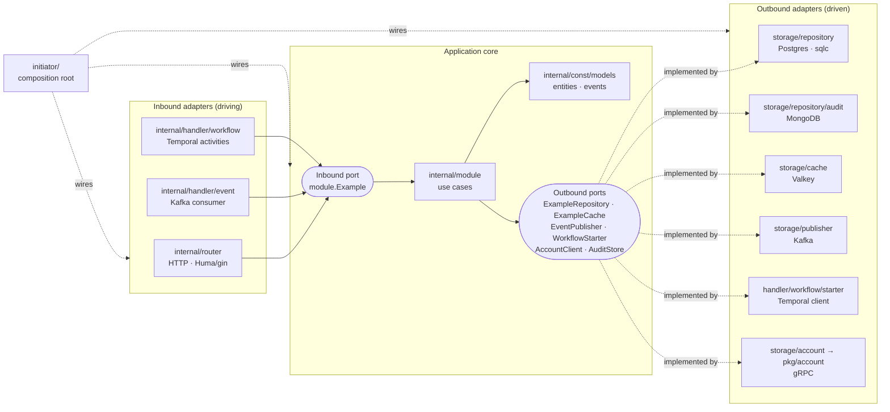

# example-service

A production-ready **Go service template** built on **hexagonal architecture** (ports and adapters). Clone it, run `make rename`, delete the example slice, and build your own domain.

It ships one complete example: an `Example` entity that you create over REST. It is stored in Postgres, cached in Valkey and announced on Kafka. A worker consumes the event, runs a Temporal workflow that checks the owner over gRPC, writes an audit record to MongoDB and marks the entity as processed. Every pattern you need is shown once, end to end.

---

## Table of contents

1. [Stack](#1-stack)
2. [Architecture: how concerns are separated](#2-architecture-how-concerns-are-separated)
   - Runtime design: [docs/architecture.md](docs/architecture.md)
3. [Project layout](#3-project-layout)
4. [Getting started](#4-getting-started)
5. [Configuration](#5-configuration)
6. [Recipes](#6-recipes)
7. [Testing strategy](#7-testing-strategy)
8. [Benchmarking and performance](#8-benchmarking-and-performance)
9. [Observability](#9-observability)
10. [Using this as a template](#10-using-this-as-a-template)
11. [Make targets](#11-make-targets)
12. [Claude Code skills](#12-claude-code-skills)

---

## 1. Stack

| Concern | Library | Why |
|---|---|---|
| HTTP router | [gin](https://github.com/gin-gonic/gin) | Fast, ubiquitous, large middleware ecosystem |
| API + OpenAPI | [huma v2](https://huma.rocks) (`humagin` adapter) | Typed handlers; generates the OpenAPI 3.1 spec and validates input from struct tags |
| CORS | [gin-contrib/cors](https://github.com/gin-contrib/cors) | Standard CORS middleware |
| Config | [koanf v2](https://github.com/knadh/koanf) | YAML file plus env overrides, small dependency tree |
| Logging | [zap](https://github.com/uber-go/zap) | Structured, very low overhead |
| Postgres | [pgx v5](https://github.com/jackc/pgx) + [sqlc](https://sqlc.dev) | Type-safe Go generated from plain SQL. No ORM magic |
| Migrations | [golang-migrate](https://github.com/golang-migrate/migrate) | Versioned up/down SQL, embedded in the binary |
| Document store | [mongo-driver v2](https://github.com/mongodb/mongo-go-driver) | Official driver |
| Cache | [go-redis v9](https://github.com/redis/go-redis) → [Valkey](https://valkey.io) | Valkey is wire-compatible with Redis |
| Messaging | [franz-go](https://github.com/twmb/franz-go) → [Redpanda](https://redpanda.com) | Pure Go, fastest Kafka client, Kafka-API compatible broker |
| Workflows | [Temporal Go SDK](https://github.com/temporalio/sdk-go) | Durable, retryable orchestration |
| gRPC | [grpc-go](https://github.com/grpc/grpc-go) + [buf](https://buf.build) | Contract-first clients |
| Domain validation | [validator v10](https://github.com/go-playground/validator) | Validates entities and events inside the core |
| Errors | [errorx](https://github.com/joomcode/errorx) | Typed error taxonomy with wrapping and traits |
| IDs | [google/uuid](https://github.com/google/uuid) | |
| Tracing | [OpenTelemetry](https://opentelemetry.io) (otelgin, otelgrpc, otelpgx, redisotel, kotel, Temporal interceptor) | One trace across HTTP → Kafka → Temporal → gRPC |
| Unit tests | [testify](https://github.com/stretchr/testify) + [mockery v3](https://vektra.github.io/mockery) | Generated mocks for every port |
| E2E tests | [godog](https://github.com/cucumber/godog) + [testcontainers-go](https://golang.testcontainers.org) | Gherkin features against real infrastructure |
| Benchmarks | `testing.B` + [benchstat](https://pkg.go.dev/golang.org/x/perf/cmd/benchstat) + pprof + [k6](https://k6.io) | Micro to load |
| Lint | [golangci-lint v2](https://golangci-lint.run) | Includes `depguard` rules that **enforce the architecture** |

Dev tools are pinned in `go.mod` with the `tool` directive (Go 1.24+), so `go tool <name>` always runs the same version for everyone: buf, protoc-gen-go(-grpc), mockery, migrate, benchstat, golangci-lint. sqlc and k6 run through Docker images pinned in the Makefile.

---

## 2. Architecture: how concerns are separated

> Runtime design (sequence diagrams, deployment, data and event catalog, roadmap): [docs/architecture.md](docs/architecture.md).

### 2.1 The idea

Hexagonal architecture puts the **business logic (the core)** in the middle. The core declares **ports**: Go interfaces describing what it offers and what it needs. Everything that touches the outside world is an **adapter** that implements or calls a port.

- **Inbound (driving) adapters** turn external input into calls on the core. Here that is HTTP, Kafka records and Temporal activities.
- **Outbound (driven) adapters** implement the interfaces the core needs. Here that is Postgres, Mongo, Valkey, the Kafka publisher, the Temporal starter and the gRPC account client.

The core never knows which adapters exist. You can swap Postgres for something else, or HTTP for gRPC, without touching a line of business logic. You can also unit-test the core with in-memory mocks in microseconds.



### 2.2 The dependency rule

> **Source code dependencies point inward.** Adapters depend on the core. The core depends only on the domain. Nothing depends on `initiator` except `main`.

`initiator/` is the **composition root**, the *only* package that knows every concrete type. It builds the platform clients, plugs adapters into ports and starts the processes.

### 2.3 Layer by layer

| Folder | Layer | Responsibility | May import | Must **not** import |
|---|---|---|---|---|
| `internal/const/models` | Domain | Entities, value objects, events, `validate` tags | stdlib, `uuid` | anything internal, any infra library |
| `internal/const/errors` | Domain | Error taxonomy (errorx types) and HTTP status mapping | `errorx` | adapters |
| `internal/module` | Core (application) | Declares ports. Implements use cases. Validates domain rules | `models`, `errors`, `validator`, `zap` | gin, huma, pgx, mongo, go-redis, franz-go, temporal, grpc, `storage`, `router`, `handler`, `pkg`, `initiator` |
| `internal/const/dto` | Inbound adapter (HTTP shapes) | Request/response structs with Huma tags. Converts to/from models | `models` | `storage`, `module`, platform clients, infra drivers |
| `internal/router` | Inbound adapter (HTTP) | Registers Huma operations. Maps DTO ↔ model. Maps errors → HTTP | `module` (ports), `dto`, huma, gin | `storage` |
| `internal/handler/event` | Inbound adapter (Kafka) | Poll loop, decoding, retry/poison handling | `module` (ports), franz-go | `storage` |
| `internal/handler/workflow` | Inbound adapter (Temporal) and `WorkflowStarter` adapter | Workflows orchestrate; activities call the module. Maps errors → retry semantics | `module`, temporal | `storage` |
| `internal/storage/*` | Outbound adapters | Implement ports. Translate driver errors into `errors` types | `module` (port interfaces), `models`, drivers | `router`, `handler` |
| `internal/storage/repository/db` | Generated | sqlc output. **Do not edit** | | |
| `internal/const/database`, `cache`, `messaging`, `workflow` | Platform clients | *How to connect* (pools, pings, tracing hooks). No business knowledge. Imported only by `initiator` and `internal/storage` | `config`, drivers | `module` |
| `internal/const/migrations`, `queries` | Schema | golang-migrate files (also the sqlc schema) and sqlc queries | | |
| `pkg/account` | Reusable SDK | gRPC client for an external service, importable by other services | grpc, generated code | `internal/...` |
| `config` | Config | Typed config struct and loader | koanf | internal packages |
| `initiator` | Composition root | Config → platform → adapters → modules → servers. Lifecycle and shutdown | everything | |
| `cmd/*` | Entry points | `main()` calls `initiator`. The only importer of `initiator`, apart from `tests/e2e` | `initiator` | |

These rules are **enforced by the linter**. `.golangci.yml` has `depguard` rules, so for example importing pgx from `internal/module` fails `make lint`:

```
internal/module/x.go:3:8: import 'github.com/jackc/pgx/v5' is not allowed from list 'core':
core must not know the database; declare a port (depguard)
```

### 2.4 Where ports live and why

Ports are declared **in the package that uses them** (`internal/module/example.go`), not next to their implementations. This is the Go way: *accept interfaces, return structs*. The core owns its contracts, and adapters assert conformance at compile time:

```go
var _ module.ExampleRepository = (*example)(nil)
```

### 2.5 Validation: two layers, two jobs

| Where | Tool | Validates | Example |
|---|---|---|---|
| Edge (`dto`, `router`) | Huma struct tags (`minLength`, `maximum`, `format`) | **Shape** of HTTP input. Fails fast with `422` before the core runs | `name` is a string of 3-100 chars |
| Core (`models`, `module`) | `validator/v10` tags + code | **Business invariants**, whatever the entry point (HTTP, Kafka, Temporal) | an event must carry an ID; owner must be active |

Huma validation also documents the API (it ends up in the OpenAPI spec). Core validation protects the domain from callers that skip HTTP, such as Kafka.

### 2.6 How errors flow

```
driver error (pgx.ErrNoRows)
   └─▶ outbound adapter wraps it      apperrors.ErrNotFound.New("example %s not found")
        └─▶ module returns it unchanged (or creates its own, e.g. ErrForbidden)
             ├─▶ router:   apperrors.HTTPStatus(err) → 404, PublicMessage(err) → body
             ├─▶ activity: ErrNotFound/ErrForbidden/... → NonRetryableApplicationError
             └─▶ consumer: ErrInvalidInput → poison, skip;  anything else → retry
```

- Only adapters know driver errors. Only the core and adapters know `errorx` types.
- 5xx messages are **never** sent to clients. They are logged with the trace ID instead.

### 2.7 DTO vs model

- **Model** (`internal/const/models`): the domain's view, used everywhere inside.
- **DTO** (`internal/const/dto`): the API contract, versioned with the API. It is converted at the router boundary (`ToModel`, `ExampleFromModel`).
- **sqlc row** (`db.Example`): the table's view. It is converted at the repository boundary (`toModel`).

Three shapes of the same thing might look redundant. They are what let the API, the domain and the schema evolve independently.

### 2.8 Lifecycle of one request, file by file

`POST /v1/examples {"name":"first","owner_id":"acc_1"}`

| # | File | What happens |
|---|---|---|
| 1 | `initiator/handler.go` | gin middleware: recovery → **otelgin** span → zap request log → CORS |
| 2 | `internal/const/dto/example.go` | Huma decodes into `CreateExampleRequest` and validates tags (`422` on failure) |
| 3 | `internal/router/example.go` | `create()` → `in.Body.ToModel()` → `module.Create(ctx, model)` |
| 4 | `internal/module/example.go` | Assigns ID and `pending` status, runs `validator` checks |
| 5 | `internal/storage/repository/example.go` | sqlc `CreateExample` over the pgx pool (traced by otelpgx) |
| 6 | `internal/storage/cache/example.go` | `SET example:<id>` in Valkey with TTL (best effort) |
| 7 | `internal/storage/publisher/example.go` | Produces `example.created` keyed by ID. kotel injects `traceparent` into headers |
| 8 | `internal/router/example.go` | Model → DTO → `201 Created` |

### 2.9 Lifecycle of one event → workflow

| # | File | What happens |
|---|---|---|
| 1 | `internal/handler/event/consumer.go` | Poll loop receives the record and continues the producer's trace |
| 2 | `internal/handler/event/example.go` | Decodes JSON (`ErrInvalidInput` = poison) → `module.HandleCreated` |
| 3 | `internal/module/example.go` | Validates the event → `WorkflowStarter.StartProcessExample` |
| 4 | `internal/handler/workflow/starter.go` | `ExecuteWorkflow` with ID `process-example-<id>`. A redelivered event is a no-op |
| 5 | `internal/handler/workflow/example.go` | `ProcessExampleWorkflow` → activity `VerifyOwner` |
| 6 | `internal/module/example.go` → `internal/storage/account` → `pkg/account` | Loads the example, calls account `GetAccount` over gRPC. Inactive owner → `ErrForbidden` (non-retryable) |
| 7 | `internal/handler/workflow/example.go` | Activity `MarkProcessed` |
| 8 | `internal/module/example.go` | Postgres status → `processed`, audit entry → Mongo, cache invalidated |
| 9 | `consumer.go` | Offsets committed after the batch (at-least-once) |

### 2.10 Two processes, one codebase

| Binary | Runs | Connects to |
|---|---|---|
| `cmd/api` | HTTP API | Postgres, Valkey, Kafka (producer) |
| `cmd/worker` | Temporal worker + Kafka consumer | Postgres, Valkey, Mongo, Temporal, account gRPC, Kafka (consumer) |

`initiator/platform.go` uses a `needs` struct so each process only connects to what it uses. Both binaries share the same modules and adapters.

### 2.11 Known trade-offs (read before production)

- **Dual write**: `Create` writes to Postgres and then publishes to Kafka. If the publish fails, the row exists but no event is sent (this is logged). If you need a guarantee, use a **transactional outbox**: write the event to an `outbox` table in the same transaction and relay it.
- **Consumer retries** are in-process (3 attempts with backoff), then the record is dropped and logged. Add a dead-letter topic at the marked extension point in `consumer.go`.
- pprof binds to `127.0.0.1` only. Inside containers, use `kubectl port-forward` / `docker exec`, or change the bind address deliberately.

---

## 3. Project layout

```
.
├── cmd/
│   ├── api/main.go                 # HTTP API entry (also: -openapi to print the spec)
│   └── worker/main.go              # Temporal worker + Kafka consumer entry
├── config/
│   ├── config.go                   # typed Config + koanf loader (file + APP_* env)
│   └── config.yaml                 # local defaults (match compose.dev.yml)
├── initiator/                      # COMPOSITION ROOT
│   ├── config.go                   # config + zap logger
│   ├── platform.go                 # infra clients, OpenTelemetry, ordered shutdown
│   ├── module.go                   # adapters → ports → modules
│   ├── handler.go                  # gin + middleware + Huma API + route registry
│   └── initiator.go                # InitiateAPI / InitiateWorker / BuildAPI, graceful shutdown, pprof
├── internal/
│   ├── const/
│   │   ├── models/                 # DOMAIN entities and events
│   │   ├── errors/                 # DOMAIN error taxonomy (errorx) + HTTP mapping
│   │   ├── dto/                    # HTTP request/response shapes (Huma tags)
│   │   ├── migrations/             # golang-migrate SQL (embedded) = sqlc schema
│   │   ├── queries/                # sqlc queries
│   │   ├── database/{postgres,mongo}/  # platform clients
│   │   ├── cache/valkey/           # platform client
│   │   ├── messaging/kafka/        # platform client (franz-go + kotel)
│   │   └── workflow/temporal/      # platform client (Temporal + OTel)
│   ├── module/                     # CORE: ports + use cases
│   │   └── mocks/                  # generated by mockery (do not edit)
│   ├── router/                     # INBOUND: HTTP (Huma operations, errors, health, middleware)
│   ├── handler/
│   │   ├── event/                  # INBOUND: Kafka consumer loop + per-topic handlers
│   │   └── workflow/               # INBOUND: Temporal workflows/activities (+ starter adapter)
│   └── storage/                    # OUTBOUND adapters
│       ├── repository/             # Postgres (sqlc) + Mongo audit
│       │   └── db/                 # generated by sqlc (do not edit)
│       ├── cache/                  # Valkey
│       ├── publisher/              # Kafka producer
│       └── account/                # pkg/account SDK → AccountClient port
├── pkg/account/                    # reusable gRPC SDK (+ proto/, gen/)
├── tests/
│   ├── e2e/                        # godog features + steps (testcontainers)
│   ├── load/example.js             # k6 load test
│   └── stubs/account/              # local stub of the external account gRPC service
├── bench/                          # benchmark results (baseline.txt is committed)
├── .claude/skills/                 # Claude Code skills for this codebase
├── compose.dev.yml                 # local infrastructure
├── compose.yml                     # full stack (includes compose.dev.yml)
├── Dockerfile                      # multi-stage: api / worker / account-stub on scratch
├── Makefile                        # every workflow (make help)
├── sqlc.yaml · buf.yaml · buf.gen.yaml · .mockery.yaml · .golangci.yml
└── CLAUDE.md
```

---

## 4. Getting started

### Prerequisites

- Go **1.27+**
- Docker with Compose v2.20+ (for `include:`)
- That's it: every other tool is pinned in `go.mod` or runs in Docker.

### Option A: run the service on your host (fast feedback)

```bash
make tools            # one-time: download modules and build pinned tools
make dev-up           # postgres, mongo, valkey, redpanda, temporal, jaeger, account stub
make run-api          # terminal 1 (migrations auto-apply in development)
make run-worker       # terminal 2
```

### Option B: run everything in Docker

```bash
make up               # builds images, runs migrations, starts api + worker
make logs
```

### Try it

```bash
# create
curl -s -X POST localhost:8080/v1/examples \
  -H 'content-type: application/json' \
  -d '{"name":"first example","owner_id":"acc_1"}' | jq
# → status "pending"

# a moment later the worker has processed it
curl -s localhost:8080/v1/examples/<id> | jq .status    # → "processed"

# list, health
curl -s 'localhost:8080/v1/examples?limit=10' | jq
curl -s localhost:8080/readyz | jq
```

The account stub treats `owner_id` values specially: `inactive_*` fails the workflow as forbidden (non-retryable), and `missing_*` fails it as not found.

### UIs

| What | URL |
|---|---|
| API docs (Huma, interactive) | http://localhost:8080/docs |
| OpenAPI spec | http://localhost:8080/openapi.json (or `.yaml`) |
| Redpanda Console (topics, messages) | http://localhost:8081 |
| Temporal UI (workflows) | http://localhost:8233 |
| Jaeger (traces; set `APP_TELEMETRY__ENABLED=true` when running on host) | http://localhost:16686 |

---

## 5. Configuration

The loader is `config/config.go`. Sources are applied in order, and later sources win:

1. YAML file at `$CONFIG_PATH` (default `config/config.yaml`; in Docker `/config/config.yaml`)
2. Environment variables: prefix `APP_`, with `__` separating levels. Comma-separated values become lists.

```bash
APP_POSTGRES__URL=postgres://...      # postgres.url
APP_SERVER__PPROF_PORT=6060           # server.pprof_port
APP_KAFKA__BROKERS=b1:9092,b2:9092    # kafka.brokers (list)
```

| Key | Default | Description |
|---|---|---|
| `app.name` / `app.version` | example-service / 0.1.0 | Used in logs, traces, OpenAPI |
| `app.environment` | development | `development` = console logs + gin debug; anything else = JSON logs + release mode |
| `server.host` / `server.port` | 0.0.0.0 / 8080 | HTTP listener |
| `server.read_timeout` / `write_timeout` | 10s | HTTP timeouts |
| `server.shutdown_timeout` | 15s | Graceful shutdown budget |
| `server.cors_origins` | `["*"]` | Allowed CORS origins |
| `server.pprof_port` | 0 (off) | Admin pprof listener on 127.0.0.1 |
| `postgres.url` | local | pgx connection string |
| `postgres.max_conns` | 10 | Pool size |
| `postgres.auto_migrate` | true | Apply embedded migrations on startup (compose disables it; the `migrate` job owns the schema) |
| `mongo.uri` / `mongo.database` | local / example | |
| `valkey.url` / `valkey.ttl` | redis://localhost:6379/0 / 5m | Cache TTL |
| `kafka.brokers` | localhost:19092 | |
| `kafka.consumer_group` | example-service | |
| `kafka.topics.example_created` | example.created | |
| `temporal.host_port` / `namespace` / `task_queue` | localhost:7233 / default / example-service | |
| `account.address` / `account.timeout` | localhost:9090 / 3s | Account gRPC service |
| `telemetry.enabled` | false | Export traces via OTLP |
| `telemetry.otlp_endpoint` | localhost:4317 | OTLP gRPC endpoint |
| `telemetry.sample_ratio` | 1.0 | Parent-based ratio sampler |

To add config, add a field with a `koanf` tag to `config.Config`, a default to `config.yaml`, and a row to this table.

---

## 6. Recipes

Each recipe has a matching Claude Code skill in `.claude/skills/` (see [§12](#12-claude-code-skills)).

### 6.1 Add a new domain (entity)

Example: `Order`. Follow the `Example` files as the reference.

1. **Schema**: `make migrate-new NAME=create_orders`, then fill the up and down files.
2. **Queries**: add `internal/const/queries/order.sql` (`-- name: CreateOrder :one`, ...), then `make sqlc`.
3. **Domain**: `internal/const/models/order.go` with the entity, its events and `validate` tags.
4. **Errors**: reuse the existing types. Add a new errorx type only for a genuinely new category.
5. **Core**: `internal/module/order.go` with:
   - the inbound port `Order` interface;
   - the outbound ports `OrderRepository` and the rest;
   - an `OrderDeps` struct and `NewOrder`.

   Then run `make mocks`.
6. **Outbound adapters**: `internal/storage/repository/order.go` (and cache/publisher if needed), each with `var _ module.X = (*impl)(nil)` and errors mapped to `apperrors`.
7. **DTOs**: `internal/const/dto/order.go`, with Huma tags and `ToModel`/`FromModel`.
8. **Inbound adapter**: `internal/router/order.go` with `RegisterOrder(api, m, logger)`.
9. **Wire it** in `initiator/`:
   - `module.go`: add a field to `Modules` and build the adapters and module.
   - `handler.go`: add `router.RegisterOrder(...)` to `registerRoutes`.
10. **Tests**: `internal/module/order_test.go` (mocks), a router test, and a `tests/e2e/features/order_rest.feature` with steps.
11. Run `make generate lint test test-e2e`.

### 6.2 Add a migration and a query

```bash
make migrate-new NAME=add_priority_to_examples
# edit internal/const/migrations/00000N_add_priority_to_examples.{up,down}.sql
# add/edit queries in internal/const/queries/*.sql
make sqlc            # regenerate internal/storage/repository/db
make migrate-up      # apply to the local DB (or just restart run-api)
```

Then update the repository adapter's mapping (`toModel`) and the domain model. Migrations are embedded, so new binaries carry them automatically.

### 6.3 Add an endpoint

1. Add the input/output structs to `dto/` (path/query/body plus validation tags).
2. Add a method to the inbound port in `module`, implement it, and run `make mocks`.
3. `huma.Register(api, huma.Operation{OperationID, Method, Path, Summary, Tags}, h.handler)` in the router file.
4. Return errors through `h.errs.toHuma(ctx, err)`. Never build status codes by hand.
5. Add a router test, a Gherkin scenario, and run `make openapi` to refresh `docs/openapi.yaml`.

### 6.4 Add a Kafka topic and consumer

1. Add the topic name to `config.Topics` and `config.yaml`.
2. Define the event struct in `models` (with `validate` tags).
3. **Publish**: add a method to the `EventPublisher` port, or create a new port, then implement it in `internal/storage/publisher/`. Key records by entity ID to keep ordering.
4. **Consume**: add `internal/handler/event/<name>.go` returning a `HandlerFunc` that decodes and calls the module. Return `ErrInvalidInput` for undecodable records.
5. Register it in `InitiateWorker`'s `handlers` map (`initiator/initiator.go`).
6. Handlers must be **idempotent**, because delivery is at least once.

### 6.5 Add a Temporal workflow

1. Write the workflow function in `internal/handler/workflow/<name>.go`. It must be **deterministic**: no I/O, `time.Now`, randomness or goroutines. Use `workflow.*` APIs instead.
2. Make the activities thin methods on `Activities` that call the module and wrap errors with `toTemporalErr`.
3. Register them in `Register()`.
4. To start the workflow from the core, add a method to a `WorkflowStarter`-style port and implement it in `starter.go` with a **deterministic workflow ID** for idempotency.
5. Test with `testsuite.WorkflowTestSuite` and module mocks (see `example_test.go`).

### 6.6 Add a gRPC client

1. Put the proto in `pkg/<service>/proto/<service>/v1/*.proto` and add the path to `buf.yaml` modules and `buf.gen.yaml` outputs.
2. Run `make proto`.
3. Add `pkg/<service>/grpc.go` (Dial with `otelgrpc`) and `client.go` (an SDK returning its own types). It must **not** import `internal/`.
4. Add an outbound port in `module`, and an adapter in `internal/storage/<service>/` that converts SDK types to models and gRPC codes to `apperrors`.
5. Add config (`address`, `timeout`), connect it in `platform.go`, and wire it in `module.go`.

---

## 7. Testing strategy

| Level | Where | Runs with | Docker? | Speed |
|---|---|---|---|---|
| Core unit | `internal/module/*_test.go` | mockery mocks for every port | no | ms |
| HTTP adapter | `internal/router/*_test.go` | real gin + Huma, mocked module, `httptest` | no | ms |
| Workflow | `internal/handler/workflow/*_test.go` | Temporal `testsuite` (time-skipping) + mocks | no | ms |
| Adapter integration | `internal/storage/**/*_test.go` | testcontainers (mongo, postgres, valkey) | yes | seconds |
| End-to-end | `tests/e2e` | godog features. The real API (`initiator.BuildAPI`) runs in-process against testcontainers postgres, valkey and redpanda | yes | ~10s, plus image pulls on the first run |

```bash
make test        # unit only: go test -short -race ./...
make test-e2e    # gherkin features, verbose
make test-all    # everything
make cover
```

Conventions:

- Tests that need Docker check `testing.Short()` and skip, so `make test` never needs Docker.
- Mock expectations use the typed `EXPECT()` API. Mocks fail the test on unexpected calls, which is how the router test proves that invalid input never reaches the core.
- E2E steps keep per-scenario state in a fresh `steps` struct. Add new steps in `tests/e2e/steps_test.go`.

---

## 8. Benchmarking and performance

### 8.1 Micro-benchmarks for each layer

Benchmarks use Go 1.24's `b.Loop()` (setup is excluded automatically) and `b.ReportAllocs()`.

| Benchmark | Measures | Docker |
|---|---|---|
| `internal/module/example_bench_test.go` | Pure business logic with in-memory fakes (not mocks, which add reflection overhead): API use cases (create, get, list) and worker use cases (handle created, verify owner, mark processed) | no |
| `internal/router/example_bench_test.go` | HTTP adapter cost: routing, Huma decode/validate, DTO mapping, JSON encode (create, get, list at 20 and 100 items) | no |
| `internal/handler/event/example_bench_test.go` | Kafka adapter cost: JSON decode and dispatch of `example.created` | no |
| `internal/handler/workflow/example_bench_test.go` | Temporal activity adapter cost: ID parsing and error-to-retry mapping | no |
| `internal/storage/cache/example_bench_test.go` | Valkey round-trip and JSON codec | yes |
| `internal/storage/repository/example_bench_test.go` | Postgres create/get/list through sqlc + pgx | yes |

```bash
make bench                                   # all, 6 runs each → bench/current.txt
make bench BENCH_PKGS=./internal/router      # one package
go test -short -run='^$' -bench=. ./internal/...   # quick, skips docker benchmarks
```

New or changed use cases, endpoints, handlers, activities and adapters ship with a benchmark in the same change. The rules are in `.claude/skills/add-benchmark` ("When a benchmark is required").

### 8.2 Detecting regressions with benchstat

```bash
make bench-baseline     # on main: records bench/baseline.txt (commit it)
# ...make changes...
make bench-compare      # fresh run vs baseline, with statistical significance
```

```
                    │ baseline.txt │            current.txt             │
                    │    sec/op    │   sec/op     vs base               │
CreateExample-8        15.31µ ± 2%   12.10µ ± 1%  -20.97% (p=0.002 n=6)
```

Trust a delta only when `p < 0.05`. `~` means there is no significant difference. Use `BENCH_COUNT` ≥ 6.

### 8.3 Profiling

```bash
make bench-profile PKG=./internal/router   # CPU profile in the pprof web UI; bench/mem.out has allocations
go tool pprof -http=:0 bench/pkg.test bench/mem.out
```

For a **running** service, set `APP_SERVER__PPROF_PORT=6060` and then:

```bash
go tool pprof -http=:0 http://127.0.0.1:6060/debug/pprof/profile?seconds=30   # CPU
go tool pprof -http=:0 http://127.0.0.1:6060/debug/pprof/heap                 # heap
curl -o trace.out http://127.0.0.1:6060/debug/pprof/trace?seconds=5 && go tool trace trace.out
```

### 8.4 Load testing with k6

`tests/load/example.js` ramps to 20 virtual users. Each one creates an example and reads it twice (the second read is a cache hit).

```bash
make up            # or dev-up + run-api
make load-test     # BASE_URL=http://host.docker.internal:8080 by default
```

The thresholds fail the run (non-zero exit, CI-friendly) when:

- `http_req_failed` ≥ 1%
- create p95 ≥ 250ms
- get p95 ≥ 100ms

Tune them to your SLOs. Look at `http_req_duration{name:...}` for each endpoint, and correlate slow requests in Jaeger.

---

## 9. Observability

- **Logs**: zap. Console output in development, JSON elsewhere. Every request logs method, path, status, latency and `trace_id`. 5xx errors log the full internal error with `trace_id`, and the client sees only `internal server error`.
- **Traces**: OpenTelemetry with W3C `traceparent` propagation (always on, even when export is off):
  - HTTP → `otelgin`
  - SQL → `otelpgx`
  - Valkey → `redisotel`
  - Kafka produce/consume → `kotel`, with the context carried in record headers
  - Temporal → the tracing interceptor on client and worker
  - gRPC → `otelgrpc`

  One `POST` therefore shows in Jaeger as a single trace that spans the API, Kafka, the worker, the Temporal activities and the account gRPC call.
- **Health**: `/healthz` checks liveness (the process is up). `/readyz` checks readiness: it pings every dependency of the process in parallel and returns `503` with details if any fails.
- To enable export, set `APP_TELEMETRY__ENABLED=true` (already set in `compose.yml`) and `APP_TELEMETRY__OTLP_ENDPOINT`.

---

## 10. Using this as a template

```bash
git clone <this repo> my-service && cd my-service
rm -rf .git && git init
make rename MODULE_NEW=github.com/my-org/my-service
make tools generate test
```

Then:

1. Update `app.name` in `config/config.yaml`, the compose project `name:`, and `.golangci.yml` (the rename handles the module path in it).
2. Build your first domain using [§6.1](#61-add-a-new-domain-entity) with the example as a reference.
3. Delete the example slice once you no longer need it:
   - `models/example.go`, `dto/example.go`, `module/example*.go`
   - `router/example*.go`, `handler/event/example.go`, `handler/workflow/example*.go`
   - `storage/*/example*.go`, `queries/initial.sql`, `migrations/000001_*`
   - `tests/e2e/features/example_rest.feature`, `tests/load/example.js`

   Then remove their wiring in `initiator/`.
4. Replace `pkg/account` and `tests/stubs/account` with your real dependencies, or remove them.
5. `make generate lint test`.

---

## 11. Make targets

Run `make help` for the live list.

| Group | Target | Description |
|---|---|---|
| Setup | `tools` | Download modules and build pinned dev tools |
| | `rename MODULE_NEW=...` | Rename the Go module across the repo |
| Run | `run-api` / `run-worker` | Run on the host (needs `dev-up`) |
| | `dev-up` / `dev-down` | Local infrastructure (`compose.dev.yml`) |
| | `up` / `down` / `logs` | Full stack (`compose.yml`) |
| Codegen | `generate` | `sqlc` + `proto` + `mocks` + `openapi` |
| | `sqlc` | Queries → `internal/storage/repository/db` |
| | `proto` | buf lint + generate gRPC code |
| | `mocks` | mockery → `internal/module/mocks` |
| | `openapi` | Spec → `docs/openapi.yaml` |
| Database | `migrate-new NAME=` | New up/down migration pair |
| | `migrate-up` / `migrate-down` / `migrate-force V=` | Run against `DB_URL` |
| Quality | `fmt` / `vet` / `lint` | Formatting, vet, golangci-lint (with architecture rules) |
| | `test` / `test-e2e` / `test-all` / `cover` | See [§7](#7-testing-strategy) |
| Benchmarks | `bench` / `bench-baseline` / `bench-compare` | See [§8](#8-benchmarking-and-performance) |
| | `bench-profile PKG=` / `load-test` | pprof and k6 |
| Build | `build` / `docker-build` / `clean` | Binaries in `bin/`, images, cleanup |

---

## 12. Claude Code skills

`.claude/skills/` teaches Claude Code this codebase's conventions, so generated code follows the same architecture. Each skill is a step-by-step checklist that points at the example files as the canonical pattern.

| Skill | Use it to |
|---|---|
| `architecture-rules` | Check layer responsibilities and import rules before editing any layer |
| `add-domain` | Scaffold a new entity across every layer |
| `add-migration-query` | Change the schema and queries with golang-migrate + sqlc |
| `add-endpoint` | Add a Huma operation, with tests and a Gherkin scenario |
| `add-kafka-consumer` | Add a topic, publisher, consumer handler and worker registration |
| `add-temporal-workflow` | Add a workflow, activities, registration and a testsuite test |
| `add-grpc-client` | Add a proto, SDK in `pkg/`, port, adapter and wiring |
| `add-benchmark` | Write `b.Loop` benchmarks, compare with benchstat, profile, extend k6 |

`CLAUDE.md` at the root gives Claude the short version and links here.
