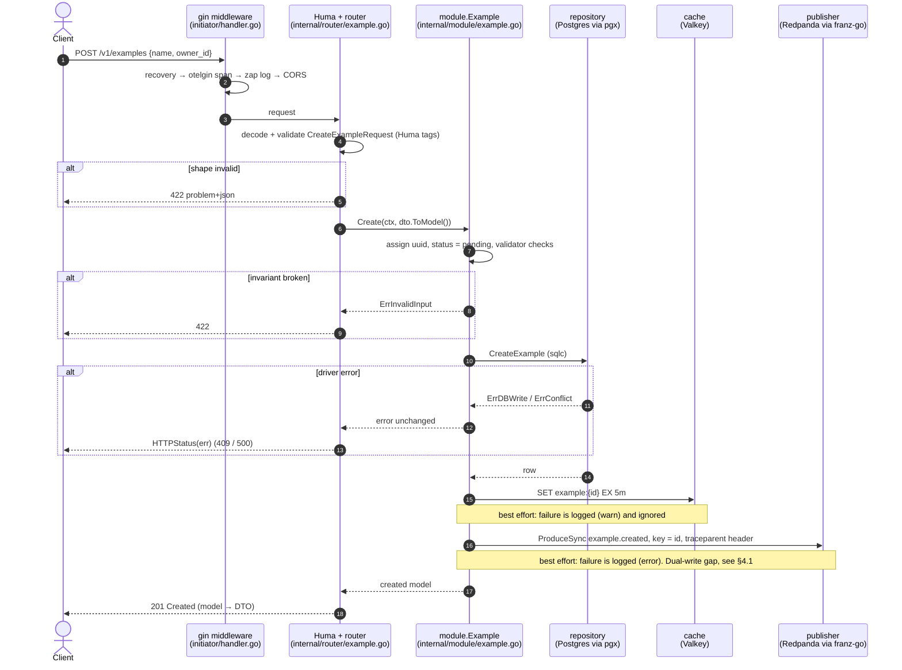
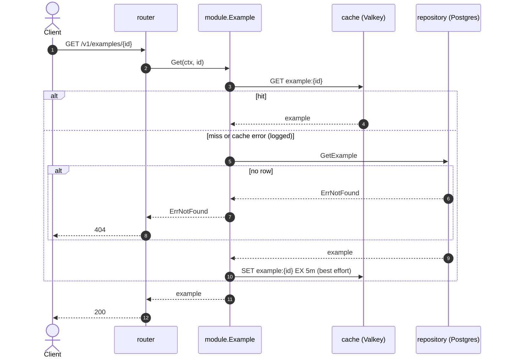
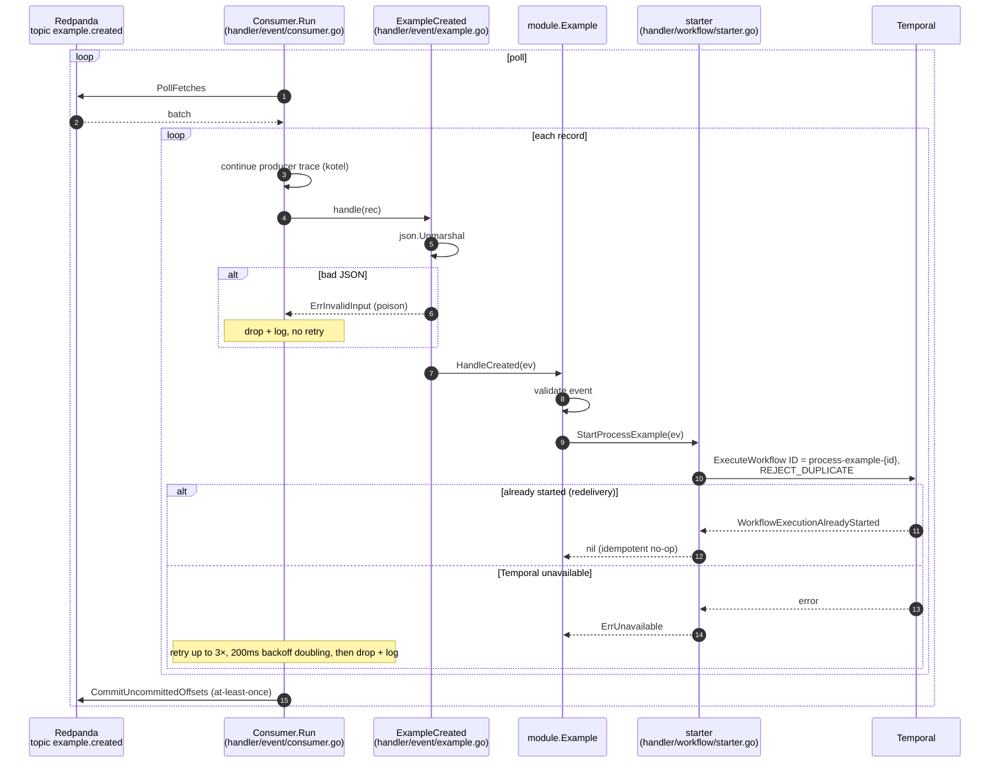
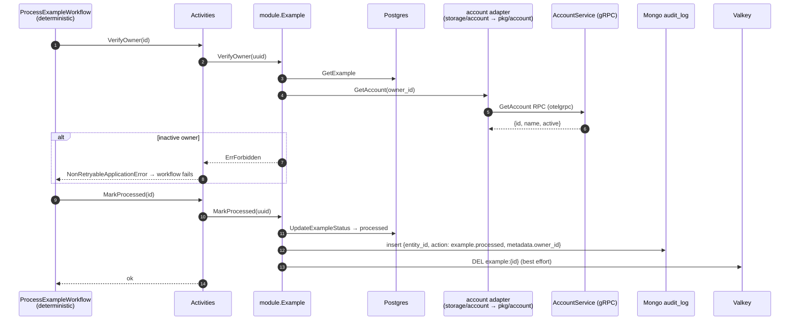
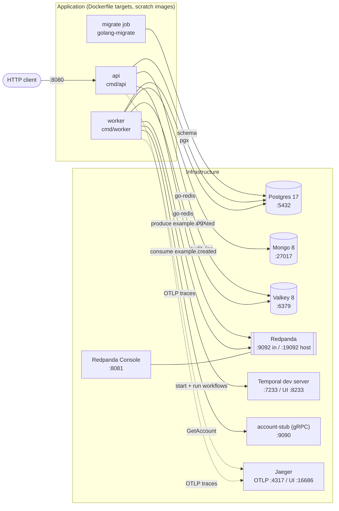
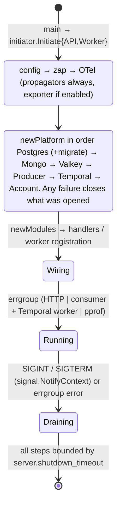
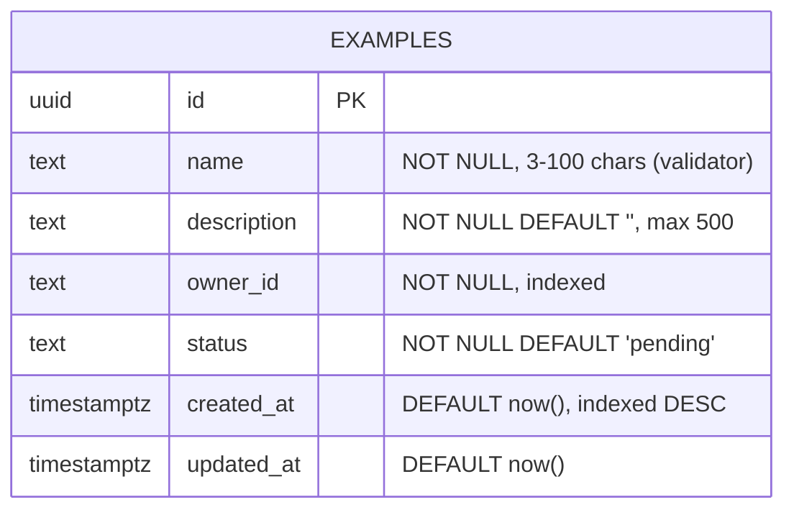
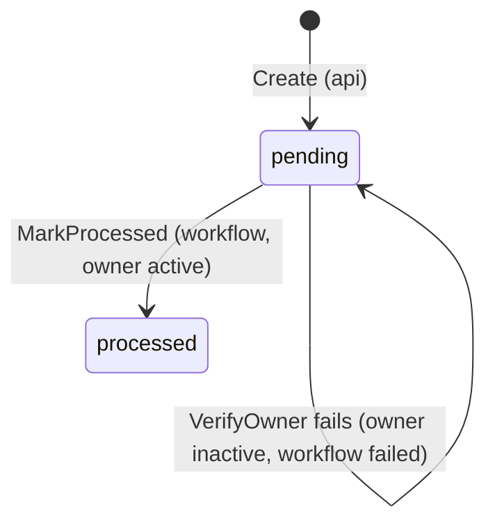

# Architecture design

This document describes how the service behaves at **runtime**: who calls whom, in what order, over which infrastructure, and with what data and event contracts. It also lists the known gaps and the roadmap.

The **static** structure is defined in [README §2](../README.md#2-architecture-how-concerns-are-separated): hexagonal layers, the dependency rule, import rules (depguard), where ports live, validation and DTO/model separation. That section is the source of truth for layering. This document does not repeat it.

| Term | Meaning here |
|---|---|
| **Core** | `internal/module`: use cases plus port interfaces. Depends only on `internal/const/models` and `internal/const/errors`. |
| **Inbound adapter** | Turns external input into a core call: `internal/router` (HTTP), `internal/handler/event` (Kafka), `internal/handler/workflow` activities (Temporal). |
| **Outbound adapter** | Implements a core port: `internal/storage/*` (Postgres, Mongo, Valkey, Kafka publisher, account gRPC) and `internal/handler/workflow/starter.go` (Temporal). |
| **Composition root** | `initiator/`. The only package that knows concrete types. |

Contents:

1. [Sequence diagrams](#1-sequence-diagrams)
2. [Deployment and runtime](#2-deployment-and-runtime)
3. [Data, events and contracts](#3-data-events-and-contracts)
4. [Known trade-offs and roadmap](#4-known-trade-offs-and-roadmap)

---

## 1. Sequence diagrams

### 1.1 Create an example: `POST /v1/examples` (api process)

### 1.2 Read an example: `GET /v1/examples/{id}` (cache-aside)

`GET /v1/examples` (list) goes straight to Postgres. `limit` is clamped to 1–100 (default 20) and `offset` to ≥ 0 in the module.

### 1.3 Event → workflow start (worker process)

### 1.4 `ProcessExampleWorkflow` (worker process)

Activity options: `StartToCloseTimeout` 30s; retry starts at 1s, doubles each attempt up to a 1m cap, with at most 5 attempts (`internal/handler/workflow/example.go`).

### 1.5 One error, three transports

Adapters wrap driver errors into `internal/const/errors` types. Each inbound adapter then maps the same type to its own transport semantics:

| App error (`apperrors`) | HTTP (`HTTPStatus`, `router/errors.go`) | Temporal activity (`toTemporalErr`) | Kafka consumer (`consumer.go`) |
|---|---|---|---|
| `ErrInvalidInput` | 422 | non-retryable | poison: dropped immediately |
| `ErrNotFound` | 404 | non-retryable | retried, then dropped |
| `ErrConflict` | 409 | non-retryable | retried, then dropped |
| `ErrForbidden` | 403 | non-retryable | retried, then dropped |
| `ErrUnauthorized` | 401 | retryable | retried, then dropped |
| `ErrUnavailable` | 503 | retryable | retried, then dropped |
| `ErrInternal` (+ `db_read`, `db_write`, `cache`, `publish`) | 500, generic message, details logged with `trace_id` | retryable | retried, then dropped |

---

## 2. Deployment and runtime

### 2.1 Topology (`compose.yml` + `compose.dev.yml`)

Which clients each process opens is decided by the `needs` struct in `initiator/platform.go`:

| Process | Platform clients (`needs`) | Also started in `initiator.go` |
|---|---|---|
| `api` | Postgres, Valkey, Kafka producer | HTTP server, optional pprof |
| `worker` | Postgres, Mongo, Valkey, Temporal, account gRPC | Temporal worker on queue `example-service`, Kafka consumer group, optional pprof |

Compose start order: `postgres` becomes healthy, then the `migrate` job completes, then `api` (after valkey and redpanda are healthy) and `worker` (after mongo, redpanda and temporal are healthy, and account-stub has started).

### 2.2 Build artifacts

`Dockerfile` is multi-stage. A `golang:1.27-alpine` builder produces static binaries that are copied into `scratch` images. There are three targets: `api`, `worker` and `account-stub` (`tests/stubs/account`, local only).

### 2.3 Configuration

`config/config.go` (koanf) applies, in increasing precedence:

1. `config/config.yaml`, or the file at `$CONFIG_PATH`
2. environment variables `APP_<SECTION>__<KEY>` (e.g. `APP_KAFKA__BROKERS=redpanda:9092`). Comma-separated values become lists.

Schema ownership: when running on the host, `postgres.auto_migrate: true` makes the process migrate on start. In compose, `APP_POSTGRES__AUTO_MIGRATE=false` and the `migrate` job owns the schema. Use the job pattern in any shared environment.

### 2.4 Process lifecycle

Shutdown order, so that no work is accepted after its dependencies are gone:

| Step | api | worker |
|---|---|---|
| 1 | `http.Server.Shutdown` (stop accepting, drain in-flight) | close Kafka consumer client (poll loop exits) |
| 2 | pprof shutdown | `worker.Stop()` (in-flight activities finish) |
| 3 | wait for errgroup | pprof shutdown, then wait for errgroup |
| 4 | `Platform.Close`, reverse creation order (producer is **flushed** first) | `Platform.Close`, reverse creation order |
| 5 | flush OTel tracer provider | flush OTel tracer provider |

### 2.5 Observability

- **Tracing:** W3C `traceparent` and baggage are always propagated, even when exporting is off. Spans come from otelgin (HTTP), otelpgx (Postgres), redisotel (Valkey), kotel (Kafka, via record headers), the Temporal tracing interceptor and otelgrpc. So one trace covers HTTP → Kafka → workflow → gRPC. The sampler is `ParentBased(TraceIDRatioBased(telemetry.sample_ratio))`.
- **Logs:** zap. 5xx errors are logged with `trace_id`, and clients get only a generic message.
- **Profiling:** pprof runs on a separate admin listener bound to `127.0.0.1:server.pprof_port` (0 = disabled). It is never on the public port.

### 2.6 Scaling

| Component | How it scales | Limit / note |
|---|---|---|
| `api` | Horizontally. It is stateless. | Postgres pool size, Valkey connections |
| Kafka consumer | Add worker replicas to the same consumer group | Parallelism ≤ partitions of `example.created`. Per-example ordering holds because the key is the example ID. |
| Temporal worker | Add worker replicas polling `example-service` | Tune `worker.Options` concurrency. Workflow ID dedup is cluster-wide. |
| Postgres / Mongo / Valkey | Managed services in production | The compose versions are single-node dev instances |

---

## 3. Data, events and contracts

### 3.1 Postgres: `examples` (`internal/const/migrations/000001_init.up.sql`)

Queries (`internal/const/queries/initial.sql`, generated by sqlc): `CreateExample`, `GetExample`, `ListExamples` (ORDER BY created_at DESC, LIMIT/OFFSET), `UpdateExampleStatus`.

### 3.2 Other stores

| Store | Key / collection | Shape | Written by | Lifetime |
|---|---|---|---|---|
| Valkey | `example:<uuid>` | JSON `models.Example` | `Create`, `Get` (miss) | TTL `valkey.ttl` (5m). Deleted on `MarkProcessed`. |
| Mongo | `audit_log` | `{entity_id, action, metadata{owner_id}, created_at}` (`models.AuditEntry`) | `MarkProcessed` | Append-only |

### 3.3 Event catalog

| Topic (config key) | Key | Payload | Producer | Consumer | Delivery |
|---|---|---|---|---|---|
| `example.created` (`kafka.topics.example_created`) | example ID | JSON `{"id": uuid, "owner_id": string}` (`models.ExampleCreatedEvent`) | api: `storage/publisher`, `ProduceSync` | worker: `handler/event`, group `kafka.consumer_group` | At-least-once. Deduplicated by the Temporal workflow ID. |

To add a topic, follow `.claude/skills/add-kafka-consumer`.

### 3.4 Workflow catalog

| Workflow | Workflow ID | Task queue | Activities | Non-retryable errors |
|---|---|---|---|---|
| `ProcessExampleWorkflow` | `process-example-<id>` (REJECT_DUPLICATE) | `temporal.task_queue` (`example-service`) | `VerifyOwner`, then `MarkProcessed` | `invalid_input`, `not_found`, `forbidden`, `conflict` |

### 3.5 External contracts

| Contract | Source | Notes |
|---|---|---|
| HTTP API | `docs/openapi.yaml` (generated by `make openapi` from Huma) | `POST /v1/examples`, `GET /v1/examples/{id}`, `GET /v1/examples`. Errors use RFC 9457 problem+json. |
| `account.v1.AccountService/GetAccount` | `pkg/account/proto/account/v1/account.proto` (buf, STANDARD lint, FILE breaking check) | Example contract. Replace it with the real one. Client SDK in `pkg/account`. |

---

## 4. Known trade-offs and roadmap

### 4.1 Reliability

| # | Gap | Impact | Proposed fix |
|---|---|---|---|
| R1 | **Dual write** in `Create`: Postgres commit, then Kafka produce | A failed publish leaves a `pending` row that is never processed. Only an error log records it. | Transactional outbox: insert into an `outbox` table in the same transaction, then a relay (worker goroutine or Temporal schedule) publishes and marks rows sent. |
| R2 | **No DLQ**: after 3 in-process retries the record is dropped | Lost events, visible only in logs | Publish to `example.created.dlq` at the marked extension point in `consumer.go`, plus a replay tool. |
| R3 | **Head-of-line blocking**: retries run inline in the poll loop | One slow or failing record delays its partition (up to ~1.4s of backoff per record) | Acceptable at current volume. Revisit along with R2. |
| R4 | **`MarkProcessed` is not idempotent for audit** | A retry after the Mongo insert but before the activity completes writes a duplicate `audit_log` entry | Unique index on `(entity_id, action)` with an upsert, or skip when the status is already `processed`. |
| R5 | **No recovery for stuck `pending` rows** (R1, or a failed workflow) | Rows stay pending forever | A Temporal schedule that rescans old `pending` rows and starts workflows. Workflow ID dedup keeps this safe. |

### 4.2 Structure and placeholders

These folders exist but are empty. Each needs a layer and a depguard rule before it is used:

| Folder | Intended role | Layer | Rule to add to `.golangci.yml` |
|---|---|---|---|
| `pkg/milkii`, `pkg/airtime` | gRPC client SDKs for external services, following `pkg/account` (proto + buf + `Dial` + client) | SDK. Its outbound adapter goes in `internal/storage/<name>`. | Already covered by `sdk` (`pkg/**` must not import `internal`). Add the proto modules to `buf.yaml`. |
| `internal/handler/grpc` | gRPC **server** (inbound) if the service exposes RPCs | Inbound adapter | Already covered by `inbound` (no `internal/storage`). Register it in `initiator/handler.go`. |
| `internal/handler/rest` | Unused. HTTP lives in `internal/router`. | n/a | Delete it, or move `router` here. Do not keep both. |
| `utils/` | Unused | n/a | Prefer removing it. Shared helpers belong next to their consumer. A generic `utils` package tends to bypass the dependency rule. |

### 4.3 Import-rule enforcement

Every import rule in `.claude/skills/architecture-rules` is enforced by a depguard rule set in `.golangci.yml`:

| Rule set | Applies to | Denies |
|---|---|---|
| `domain` | `internal/const/models` | every internal package |
| `core` | `internal/module` (non-test) | HTTP, DB, cache, Kafka, Temporal and gRPC libraries; `storage`, `router`, `handler`, `pkg`, `initiator` |
| `inbound` | `internal/router`, `internal/handler/**` | `internal/storage` |
| `sdk` | `pkg/**` | `internal/**` |
| `composition-root` | everything except `cmd/**`, `initiator/**`, `tests/e2e/**` | `initiator` |
| `dto` | `internal/const/dto` | `internal/storage`, platform clients, infra drivers |
| `infra-clients` | everything except `initiator/**`, `internal/storage/**` and the platform-client packages themselves | `internal/const/{database,cache,messaging,workflow}` |

`tests/e2e` is the one allowed importer of `initiator` besides `cmd/*`, because it runs the real API in-process through `initiator.BuildAPI`.

### 4.4 Placement note

`internal/handler/workflow/starter.go` is an **outbound** adapter (it implements `module.WorkflowStarter`) that sits in an inbound folder. This is deliberate: all Temporal-specific code (workflow names, task queue, error mapping) stays in one package. Depguard allows it because inbound adapters are only forbidden from importing `internal/storage`.
