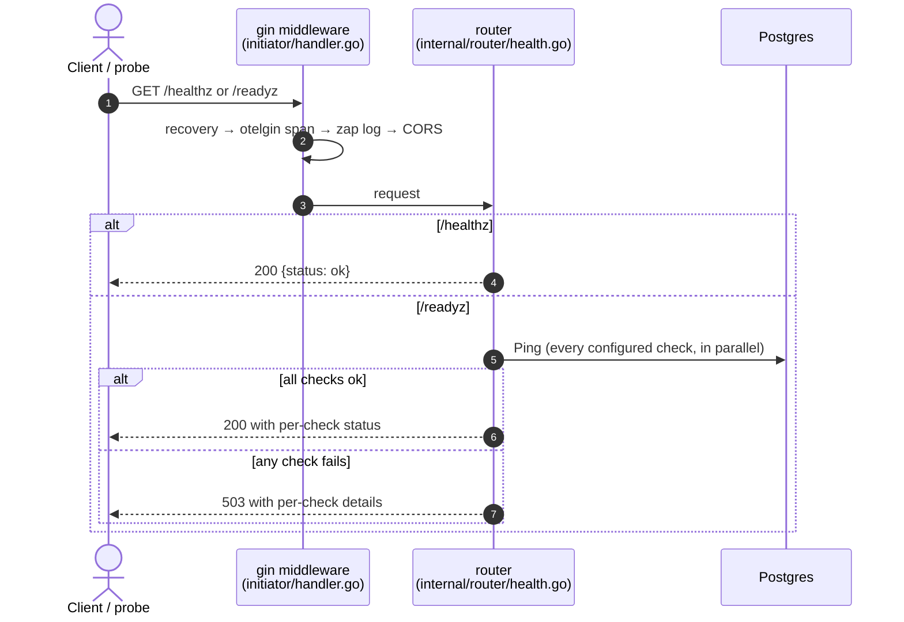
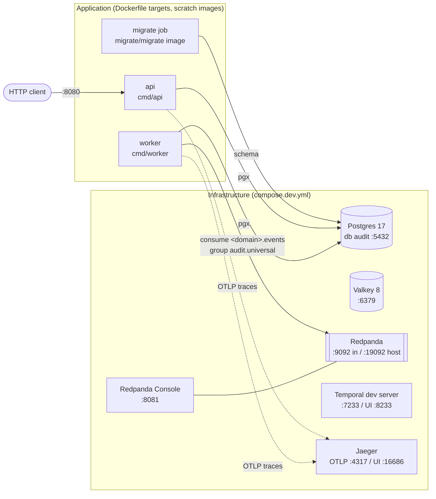
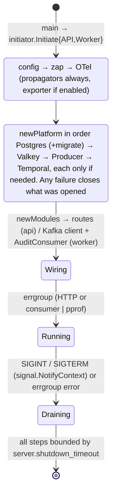
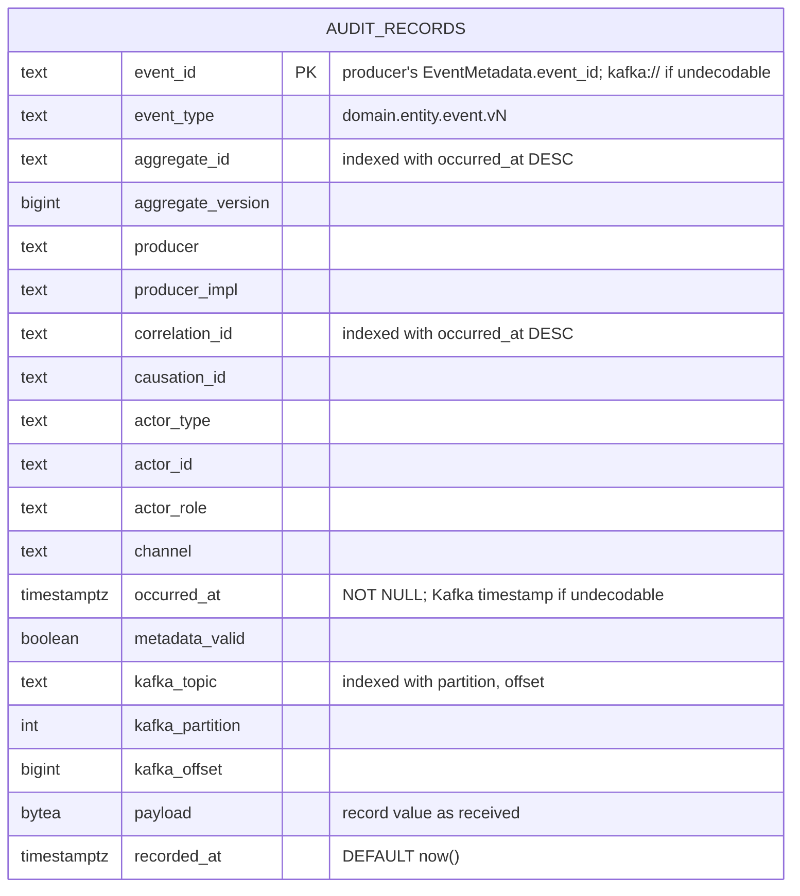

# Architecture design

This document describes how the DPS audit service behaves at **runtime**: who calls whom, in what order, over which infrastructure, and with what data and event contracts. It also lists the known gaps and the roadmap.

The **static** structure is defined in [README §2](../README.md#2-architecture): hexagonal layers, the dependency rule, import rules (depguard), where ports live and validation. That section is the source of truth for layering. This document does not repeat it.

Part of the runtime is still planned. Every flow below is labelled **implemented** or **planned**.

| Term | Meaning here |
|---|---|
| **Core** | `internal/module`: the `Audit` use case plus its port interfaces. Depends only on `internal/const/models` and `internal/const/errors`. |
| **Inbound adapter** | Turns external input into a core call: `internal/router` (HTTP), `internal/handler/event` (Kafka). |
| **Outbound adapter** | Implements a core port: `internal/storage/repository/audit.go` (Postgres / YugabyteDB YSQL, implements `module.AuditLog`). |
| **Composition root** | `initiator/`. The only package that knows concrete types. |

Contents:

1. [Runtime flows](#1-runtime-flows)
2. [Deployment and runtime](#2-deployment-and-runtime)
3. [Data, events and contracts](#3-data-events-and-contracts)
4. [Known trade-offs and roadmap](#4-known-trade-offs-and-roadmap)

---

## 1. Runtime flows

| Flow | Process | Status |
|---|---|---|
| Health and readiness (`/healthz`, `/readyz`) | `api` | implemented |
| Worker start-up (Postgres + audit consumer client) | `worker` | implemented |
| `module.Audit.Record` → `AuditLog.Append` (batch insert, dedupe on `event_id`) | called by the audit consumer | implemented, tested |
| Audit consumer: Redpanda → YSQL → commit | `worker` | implemented, tested (`make test-integration`) |
| Ceph segment in the ingest path (gates the commit too) | `worker` | planned |
| Search indexer: Redpanda → OpenSearch | separate process | planned |
| Read API `dps.audit.v1.AuditService` | `api` | planned |

### 1.1 Health and readiness (implemented, api process)



`registerRoutes` in `initiator/handler.go` is empty: there are no business routes yet. `/docs` serves the Huma API docs.

### 1.2 Worker start-up (implemented)

`cmd/worker` → `initiator.InitiateWorker` loads config, then calls `initiator.BuildWorker`: it connects to Postgres (`workerNeeds`), wires `Modules{Audit}`, opens a consumer-group client with `kafka.NewConsumer(ctx, cfg.Kafka, cfg.Kafka.Topics.List(), kgo.BlockRebalanceOnPoll())` (group `kafka.consumer_group`, `audit.universal`; a new group starts at the earliest offset; auto-commit off) and builds `event.NewAuditConsumer` from the `audit:` config. `InitiateWorker` logs `audit consumer started` with the group and topics and runs `Worker.Run` and the optional pprof server in an errgroup until SIGINT/SIGTERM. On shutdown `Worker.Close` closes the Kafka client, then the platform. No Temporal worker runs.

The generic poll loop `internal/handler/event/consumer.go` still exists for non-audit consumers but nothing uses it. It dispatches by topic through `map[string]HandlerFunc`, retries a failing record 3 times (200 ms backoff, doubling), drops it on `ErrInvalidInput` or when the retries run out, and commits offsets after each poll batch. The audit consumer (§1.3) does not use it.

### 1.3 Audit ingest: Redpanda → YSQL → commit (implemented; Ceph segment planned)

The consumer runs in `cmd/worker` as the inbound adapter `internal/handler/event/audit.go` (`AuditConsumer`), calling `module.Audit`. It consumes every topic in `kafka.topics.<domain>` (`Topics.List()`) in group `audit.universal`. The decoder is `decodeRecord` in `internal/handler/event/envelope.go`.

```mermaid
sequenceDiagram
    autonumber
    participant RP as Redpanda<br/>&lt;domain&gt;.events (17 topics)
    participant CO as AuditConsumer.Run<br/>(handler/event/audit.go)
    participant EH as decodeRecord<br/>(handler/event/envelope.go)
    participant M as module.Audit<br/>(internal/module/audit.go)
    participant DB as repository<br/>(YSQL audit_records)
    participant S3 as Ceph RGW<br/>S3 Object Lock (planned)

    loop per poll
        CO->>RP: PollRecords(max_poll_records)
        RP-->>CO: records from several partitions
        par one goroutine per partition, in order within it
            loop batches of batch_size
                CO->>EH: records
                EH->>EH: x-dps-event-type header, strip Schema Registry framing,<br/>read field 1 into eventsv1.EventMetadata
                alt undecodable or no event_id
                    EH->>EH: event_id = kafka:<topic>/<partition>/<offset>,<br/>type = header → metadata → "unknown",<br/>occurred_at = Kafka timestamp, metadata_valid = false
                end
                CO->>M: Record(ctx, []AuditRecord)
                M->>M: validator checks
                M->>DB: Append (one INSERT ... unnest, ON CONFLICT (event_id) DO NOTHING)
                alt any error
                    Note over CO,DB: retry the batch, backoff 200 ms → retry_max_backoff, never drop
                end
            end
        end
        CO-->>S3: planned: append to the partition's segment (flushed every 1–5 s)
        CO->>RP: CommitUncommittedOffsets, only after every partition of the poll is stored
        CO->>RP: AllowRebalance
    end
```

How it behaves:

- **Decode never fails.** `decodeRecord` reads the `x-dps-event-type` header, strips the Schema Registry framing (magic byte, schema ID, message indexes) or accepts plain protobuf, and unmarshals only field 1 into the generated `eventsv1.EventMetadata` (`pkg/dpsapi/gen`). Enum names become lower case without their prefix (`real`, `customer`); `channel` stays empty until dps-contracts v0.2.0. An undecodable value, or metadata without `event_id`, is stored with `metadata_valid=false` and the fallbacks shown above. The payload is always kept as received (it may be empty; `Payload` is not `validate:"required"`). `BenchmarkDecodeRecord` measures about 1 µs and 13 allocs per record.
- **Per poll, partitions in parallel.** Each poll's partitions are written concurrently, in order within a partition, in batches of `audit.batch_size` (500). A poll holds at most `audit.max_poll_records` (5000).
- **Nothing is dropped.** A failed `Audit.Record` is retried with backoff from 200 ms, doubling up to `audit.retry_max_backoff` (30s), until it succeeds or the worker shuts down. `ErrInvalidInput` is logged as a bug and retried too, so the partition stalls visibly.
- **Commit after store.** Offsets are committed (`CommitUncommittedOffsets`) only after every partition of the poll is stored, then `AllowRebalance`. A shutdown mid-poll commits nothing; the next owner reads those records again and the `event_id` primary key dedupes them. Delivery is at least once.
- **Rebalances.** The client uses `kgo.BlockRebalanceOnPoll`, so partitions are not revoked mid-batch. `Run` always calls `AllowRebalance` on exit; otherwise `Close` hangs in `LeaveGroup`.
- **Planned:** the Ceph segment write joins the path, and the commit then waits for it as well. `tests/storagebench` measures that path, including the time from record to committable offset; results are in `bench/storage/RESULTS.md`.
- **Tested** by `tests/integration/consumer_test.go` (`make test-integration`): dedupe of duplicates, the garbage record kept, column round-trip, lag reaching 0, resume after restart, and no commit during a store outage (README §6).

### 1.4 Search indexer: Redpanda → OpenSearch (planned)

```mermaid
sequenceDiagram
    autonumber
    participant RP as Redpanda<br/>&lt;domain&gt;.events
    participant IX as search indexer<br/>(separate process, planned)
    participant OS as OpenSearch

    loop poll
        IX->>RP: poll (group audit.search-indexer)
        RP-->>IX: records
        IX->>OS: bulk index (actor, event type, metadata)
        IX->>RP: commit offsets
    end
```

The indexer is a separate consumer group in a separate process, so a slow or failing OpenSearch never holds back the audit write path. Aggregate and correlation lookups stay in the database; actor, event-type and ad-hoc search go to OpenSearch.

### 1.5 One error, two transports

Adapters wrap driver errors into `internal/const/errors` types. Each inbound adapter maps the same type to its own transport:

| App error (`apperrors`) | HTTP (`HTTPStatus`, `router/errors.go`) | Audit consumer (`audit.go`) | Generic consumer (`consumer.go`, unused) |
|---|---|---|---|
| `ErrInvalidInput` | 422 | logged as a bug, retried with backoff, never dropped | dropped immediately |
| `ErrNotFound` | 404 | retried with backoff until stored | retried 3 times, then dropped |
| `ErrConflict` | 409 | retried with backoff until stored | retried 3 times, then dropped |
| `ErrForbidden` | 403 | retried with backoff until stored | retried 3 times, then dropped |
| `ErrUnauthorized` | 401 | retried with backoff until stored | retried 3 times, then dropped |
| `ErrUnavailable` | 503 | retried with backoff until stored | retried 3 times, then dropped |
| `ErrInternal` (+ `db_read`, `db_write`, `cache`, `publish`) | 500, generic message, details logged with `trace_id` | retried with backoff until stored | retried 3 times, then dropped |

The repository maps `pgx.ErrNoRows` to `ErrNotFound` and other driver errors to `ErrDBWrite` / `ErrDBRead`. The audit consumer stops retrying only when the worker shuts down, and then commits nothing for that poll. The generic consumer's dropping behaviour is R1 in §4.1.

---

## 2. Deployment and runtime

### 2.1 Topology (`compose.yml` + `compose.dev.yml`)



The worker consumes from Redpanda; Valkey and Temporal run in compose, but neither process connects to them yet. The `needs` struct in `initiator/platform.go` decides which platform clients each process opens; the worker's consumer-group client is opened separately in `initiator.BuildWorker`:

| Process | Platform clients (`needs`) today | Also started in `initiator.go` | Planned |
|---|---|---|---|
| `api` | Postgres | HTTP server (health, `/docs`), optional pprof | read API `dps.audit.v1.AuditService` |
| `worker` | Postgres | Kafka consumer-group client + `AuditConsumer` (`BuildWorker`), optional pprof | WORM segment writer |
| search indexer | n/a | n/a | separate process, group `audit.search-indexer`, writes to OpenSearch |

Compose start order: `postgres` becomes healthy, then the `migrate` job completes, then `api` (after valkey and redpanda are healthy) and `worker` (after valkey, redpanda and temporal are healthy).

### 2.2 Platform needs in production

| Platform | Used for | Status |
|---|---|---|
| YugabyteDB YSQL | `audit_records`. Plain Postgres-compatible SQL, so dev and tests use Postgres 17 | in use (Postgres in dev) |
| Redpanda | the 17 `<domain>.events` topics, groups `audit.universal` (in use) and `audit.search-indexer` (planned) | in use by the worker |
| Ceph RGW, S3 Object Lock in Compliance mode | WORM segments per partition, the tamper-evident copy | planned |
| OpenSearch | actor, event-type and ad-hoc search | planned |
| Encryption at rest | in the database and in Ceph. There is no application-level encryption | platform responsibility |
| OTLP collector | traces | optional (`telemetry.enabled`) |

### 2.3 Build artifacts

`Dockerfile` is multi-stage. A `golang:1.27-alpine` builder produces static binaries that are copied into `scratch` images. There are two targets: `api` and `worker`.

### 2.4 Configuration

`config/config.go` (koanf) applies, in increasing precedence:

1. `config/config.yaml`, or the file at `$CONFIG_PATH`
2. environment variables `APP_<SECTION>__<KEY>` (e.g. `APP_KAFKA__BROKERS=redpanda:9092`). Comma-separated values become lists.

Schema ownership: when running on the host, `postgres.auto_migrate: true` makes the process migrate on start. In compose, `APP_POSTGRES__AUTO_MIGRATE=false` and the `migrate` job owns the schema. Use the job pattern in any shared environment. `make migrate-up` is currently broken (R3 in §4.1).

### 2.5 Process lifecycle



Shutdown order:

| Step | api | worker |
|---|---|---|
| 1 | `http.Server.Shutdown` (stop accepting, drain in-flight) | pprof shutdown |
| 2 | pprof shutdown | wait for errgroup (`AuditConsumer.Run` returns, calling `AllowRebalance`) |
| 3 | wait for errgroup | `Worker.Close`: Kafka client close (leaves the group), then `Platform.Close` |
| 4 | `Platform.Close`, reverse creation order | flush OTel tracer provider |
| 5 | flush OTel tracer provider | |

The consumer stops on the signal context: an in-flight poll is abandoned uncommitted and is redelivered to the next owner (deduped on `event_id`).

### 2.6 Observability

- **Tracing:** W3C `traceparent` and baggage are always propagated, even when exporting is off. Spans come from otelgin (HTTP) and otelpgx (Postgres); kotel (Kafka, via record headers) is built into `internal/const/messaging/kafka`; the audit consumer continues the producer's trace of each batch's first record (`WithProcessSpan`). The sampler is `ParentBased(TraceIDRatioBased(telemetry.sample_ratio))`.
- **Logs:** zap. 5xx errors are logged with `trace_id`, and clients get only a generic message.
- **Profiling:** pprof runs on a separate admin listener bound to `127.0.0.1:server.pprof_port` (0 = disabled). It is never on the public port.

### 2.7 Scaling

| Component | How it scales | Limit / note |
|---|---|---|
| `api` | Horizontally. It is stateless. | Postgres pool size |
| Audit consumer | Add worker replicas to group `audit.universal` | Parallelism ≤ partitions per topic. Per-aggregate order holds because topics are keyed by aggregate ID. Commits are per poll (R4). |
| Search indexer (planned) | Add replicas to group `audit.search-indexer` | Independent of the write path |
| YSQL / Ceph / OpenSearch | Managed platforms in production | The compose Postgres is a single-node dev instance |

---

## 3. Data, events and contracts

### 3.1 Postgres / YugabyteDB YSQL: `audit_records` (`internal/const/migrations/000001_audit.up.sql`)

One append-only row per DPS domain event. It is the only migration; `000001_audit.down.sql` drops the table.



- **Dedupe:** the primary key is the producer's `event_id`, so a redelivered or re-published event is a no-op (`ON CONFLICT (event_id) DO NOTHING`). On YugabyteDB the key is hash-sharded, which spreads writes across tablets.
- **Append-only:** a `BEFORE UPDATE OR DELETE` trigger refuses changes, even from the table owner. Ops also grants the service role only `INSERT` and `SELECT`.
- **Tamper evidence:** this comes from the WORM copy in Ceph Object Lock (a later step), not from this table. There is no application-level encryption; use encryption at rest in the database and in Ceph.
- **Queries** (`internal/const/queries/audit.sql`, generated by sqlc): `InsertAuditRecords` (one statement per batch, using `unnest`) and `GetAuditRecord`.
- **Other searches:** actor and event-type search will be served by OpenSearch.

### 3.2 Other stores

None yet. The planned stores are the Ceph Object Lock segments (the WORM system of record) and an OpenSearch index (search projection).

### 3.3 Event catalog

The audit service consumes the DPS domain topics below. It produces no topics.

To add a topic, follow `.claude/skills/add-kafka-consumer`.

#### DPS domain events (consumed by audit)

The source of truth is the `dps-contracts` repo ([docs/events.md](../../dps-contracts/docs/events.md)). Each name below is the `(dps.events.v1.event).type` of a message in `proto/dps/<domain>/v1/events.proto`. `internal/const/events` mirrors that list, and each constant's comment gives its proto message. The catalog is derived from DPS-UCS-P1-001 v1.4 (data model, use cases and scenarios); service owners confirm it.

- **Names:** `domain.entity.event.vN`, the event in the past tense, multi-word segments in snake_case. `domain` is the producing service's namespace, the same one its error codes use.
- **Versioning:** a breaking change adds a `dps.<domain>.v2` package and `.v2` names on the same topic, published alongside v1.
- **Topics:** one per domain, `<domain>.events`, keyed by the aggregate ID. The event name is in the `x-dps-event-type` record header (`events.HeaderEventType`). The value is the proto in Schema Registry wire format, with subject `<topic>-<message full name>`.
- **Audit:** consumes every topic in group `audit.universal` and stores the raw value with its event type. It needs no generated code to write a record.
- **Refunds:** each refund is a Ledger `REFUND` operation, plus the domain event (`airline.refund.*`, `ticketing.ticket.refunded`, `payment.payment.reversed`). Refunds approved through maker-checker also produce `adminops.change.*`.

| Topic (config key) | Events |
|---|---|
| `auth.events` (`kafka.topics.auth`) | `auth.session.started.v1`, `auth.device.registered.v1`, `auth.payment.decided.v1`, `auth.otp.sent.v1`, `auth.otp.verified.v1`, `auth.otp.failed.v1`, `auth.sign_in.failed.v1`, `auth.session.revoked.v1`, `auth.pin.changed.v1`, `auth.credential.locked.v1`, `auth.token_family.revoked.v1`, `auth.payment.released.v1`, `auth.policy_bundle.activated.v1`, `auth.staff_role.granted.v1`, `auth.staff_role.revoked.v1` |
| `onboarding.events` (`kafka.topics.onboarding`) | `onboarding.application.started.v1`, `onboarding.application.consented.v1`, `onboarding.document.uploaded.v1`, `onboarding.kyc.passed.v1`, `onboarding.kyc.flagged.v1`, `onboarding.application.returned.v1`, `onboarding.application.completed.v1`, `onboarding.application.rejected.v1`, `onboarding.application.expired.v1`, `onboarding.application.blocked.v1` |
| `account.events` (`kafka.topics.account`) | `account.account.opened.v1`, `account.account.status_changed.v1`, `account.customer.created.v1`, `account.customer.kyc_level_changed.v1`, `account.catalog.published.v1`, `account.contact_point.changed.v1` |
| `payment.events` (`kafka.topics.payment`) | `payment.payment.initiated.v1`, `payment.payment.completed.v1`, `payment.payment.failed.v1`, `payment.payment.outcome_unknown.v1`, `payment.payment.reversed.v1`, `payment.beneficiary.added.v1`, `payment.beneficiary.deleted.v1`, `payment.request_to_pay.created.v1`, `payment.request_to_pay.paid.v1`, `payment.request_to_pay.declined.v1`, `payment.request_to_pay.expired.v1`, `payment.pre_authorization.held.v1`, `payment.pre_authorization.captured.v1`, `payment.pre_authorization.released.v1`, `payment.pre_authorization.expired.v1`, `payment.qr_code.generated.v1`, `payment.qr_code.used.v1`, `payment.qr_code.expired.v1`, `payment.merchant.onboarded.v1`, `payment.merchant.status_changed.v1` |
| `tpi.events` (`kafka.topics.tpi`) | `tpi.request.timed_out.v1`, `tpi.status.resolved.v1`, `tpi.webhook.rejected.v1` |
| `ledger.events` (`kafka.topics.ledger`) | `ledger.operation.started.v1`, `ledger.operation.completed.v1`, `ledger.operation.aborted.v1`, `ledger.operation.orphaned.v1`, `ledger.operation.resolved.v1`, `ledger.operation.captured.v1`, `ledger.recon_run.completed.v1`, `ledger.recon_exception.raised.v1`, `ledger.settlement_batch.posted.v1`, `ledger.settlement_batch.failed.v1` |
| `fee.events` (`kafka.topics.fee`) | `fee.quote.issued.v1`, `fee.rule_set.published.v1` |
| `airtime.events` (`kafka.topics.airtime`) | `airtime.order.placed.v1`, `airtime.order.completed.v1`, `airtime.order.failed.v1`, `airtime.order.outcome_unknown.v1` |
| `utility.events` (`kafka.topics.utility`) | `utility.bill.inquired.v1`, `utility.bill_payment.completed.v1`, `utility.bill_payment.failed.v1`, `utility.routing.updated.v1` |
| `airline.events` (`kafka.topics.airline`) | `airline.booking.held.v1`, `airline.booking.ticketed.v1`, `airline.booking.cancelled.v1`, `airline.booking.ticketing_failed.v1`, `airline.refund.requested.v1`, `airline.refund.completed.v1`, `airline.refund.failed.v1` |
| `notification.events` (`kafka.topics.notification`) | `notification.message.delivered.v1`, `notification.message.failed.v1`, `notification.message.read.v1`, `notification.preference.updated.v1` |
| `adminops.events` (`kafka.topics.adminops`) | `adminops.change.submitted.v1`, `adminops.change.approved.v1`, `adminops.change.rejected.v1`, `adminops.change.applied.v1`, `adminops.change.apply_failed.v1`, `adminops.change.expired.v1`, `adminops.case.opened.v1`, `adminops.case.assigned.v1`, `adminops.case.escalated.v1`, `adminops.case.closed.v1`, `adminops.report_run.completed.v1` |
| `fuel.events` (`kafka.topics.fuel`) | `fuel.purchase.confirmed.v1`, `fuel.purchase.expired.v1` |
| `lending.events` (`kafka.topics.lending`) | `lending.consent.granted.v1`, `lending.consent.revoked.v1`, `lending.assessment.completed.v1`, `lending.offer.presented.v1`, `lending.offer.accepted.v1`, `lending.offer.expired.v1`, `lending.loan.disbursed.v1`, `lending.loan.disbursement_failed.v1`, `lending.loan.overdue.v1`, `lending.loan.closed.v1`, `lending.repayment.received.v1` |
| `assistant.events` (`kafka.topics.assistant`) | `assistant.tool_call.executed.v1`, `assistant.tool_call.denied.v1`, `assistant.article.published.v1` |
| `ticketing.events` (`kafka.topics.ticketing`) | `ticketing.event.submitted.v1`, `ticketing.event.published.v1`, `ticketing.event.rejected.v1`, `ticketing.ticket.issued.v1`, `ticketing.ticket.used.v1`, `ticketing.ticket.scan_rejected.v1`, `ticketing.refund.requested.v1`, `ticketing.refund.rejected.v1`, `ticketing.ticket.refunded.v1` |
| `dwh.events` (`kafka.topics.dwh`) | `dwh.backfill.completed.v1`, `dwh.load_run.failed.v1` |

### 3.4 Workflow catalog

None. Temporal is still available for later schedules, such as WORM anchoring and reconciliation.

### 3.5 External contracts

| Contract | Source | Notes |
|---|---|---|
| HTTP API | `docs/openapi.yaml` (generated by `make openapi` from Huma) | `GET /healthz`, `GET /readyz`. Errors use RFC 9457 problem+json. |
| DPS event envelope | `pkg/dpsapi/gen`, generated by `make proto` from dps-contracts tag v0.1.0 (`buf.gen.yaml`, paths `dps/common/v1` and `dps/events/v1`) | `internal/handler/event/envelope.go` decodes only `eventsv1.EventMetadata` (field 1). Generated code: never edit it. |
| Read API `dps.audit.v1.AuditService` | planned | Read-only, served by `cmd/api`. |

---

## 4. Known trade-offs and roadmap

### 4.1 Risks

| # | Gap | Impact | Fix |
|---|---|---|---|
| R1 | **Resolved for audit.** The generic `internal/handler/event/consumer.go` still drops a record after 3 retries (and immediately on `ErrInvalidInput`), but nothing uses it | None for the audit trail. A future non-audit consumer built on `consumer.go` would drop records | `AuditConsumer` retries every failure until stored and keeps undecodable records with `metadata_valid=false` (§1.3), proven by `make test-integration`. |
| R2 | **No DLQ** | None for audit: nothing is dropped, so there is nothing to dead-letter | Not needed for audit. If a non-audit consumer ever needs one, it goes at the marked extension point in `consumer.go`. |
| R3 | **`make migrate-up` is broken**: the cached `go tool migrate` binary has no `pgx5` driver | Migrations cannot be applied from the host with `make` | Use `postgres.auto_migrate: true` (`make run-api`) or the compose `migrate` job (`migrate/migrate` image), which works. Fix the tool build (roadmap step 4). |
| R4 | **Per-poll head-of-line blocking**: partitions are stored concurrently, but offsets are committed once per poll, after every partition of that poll is stored | A partition stuck retrying (store outage, or a batch rejected as invalid) holds back the commit of the other partitions polled with it, and the next poll waits; their records are stored but redelivered if the worker restarts | Acceptable while the store is the only sink (a store outage blocks every partition anyway). If needed, commit per partition as each finishes; revisit when the Ceph segment writer gates commits. |
| R5 | **No tamper evidence yet**: there is no hash chain by design, and the WORM copy is not built | Until the Ceph segment writer exists, the append-only trigger and role grants are the only protection | WORM segment writer to Ceph Object Lock (roadmap step 1). |
| R6 | **Envelope from dps-contracts v0.1.0** lacks `EventMetadata.channel`, the per-domain topic model and the event schemas | `channel` is stored empty | Take dps-contracts v0.2.0 (roadmap step 3). |

### 4.2 Roadmap (in order)

| Step | Work |
|---|---|
| done | Audit Kafka consumer (`internal/handler/event/audit.go` + `envelope.go` in `cmd/worker`), with `tests/integration` and `make test-integration`. |
| 1 | WORM segment writer to Ceph Object Lock (the offset commit then also waits for the segment), then the OpenSearch indexer (group `audit.search-indexer`, separate process). |
| 2 | Read API `dps.audit.v1.AuditService` in `cmd/api`, read-only. |
| 3 | Take dps-contracts v0.2.0: adds `EventMetadata.channel`, the per-domain topic model and all 123 event schemas. |
| 4 | Fix `make migrate-up`. |

The storage research and benchmarks behind these choices are in the claude.ai doc "DPS Audit Storage Research" and in `bench/storage/RESULTS.md`.

### 4.3 Import-rule enforcement

Every import rule in `.claude/skills/architecture-rules` is enforced by a depguard rule set in `.golangci.yml`:

| Rule set | Applies to | Denies |
|---|---|---|
| `domain` | `internal/const/models` | every internal package |
| `core` | `internal/module` (non-test) | HTTP, DB, cache, Kafka, Temporal and gRPC libraries; `storage`, `router`, `handler`, `pkg`, `initiator` |
| `inbound` | `internal/router`, `internal/handler/**` | `internal/storage` |
| `sdk` | `pkg/**` | `internal/**` |
| `composition-root` | everything except `cmd/**`, `initiator/**`, `tests/e2e/**`, `tests/integration/**` | `initiator` |
| `dto` | `internal/const/dto` | `internal/storage`, platform clients, infra drivers |
| `infra-clients` | everything except `initiator/**`, `internal/storage/**` and the platform-client packages themselves | `internal/const/{database,cache,messaging,workflow}` |

`tests/e2e` and `tests/integration` are the only allowed importers of `initiator` besides `cmd/*`: they run the real API (`initiator.BuildAPI`) and the real worker (`initiator.BuildWorker`) in-process.
